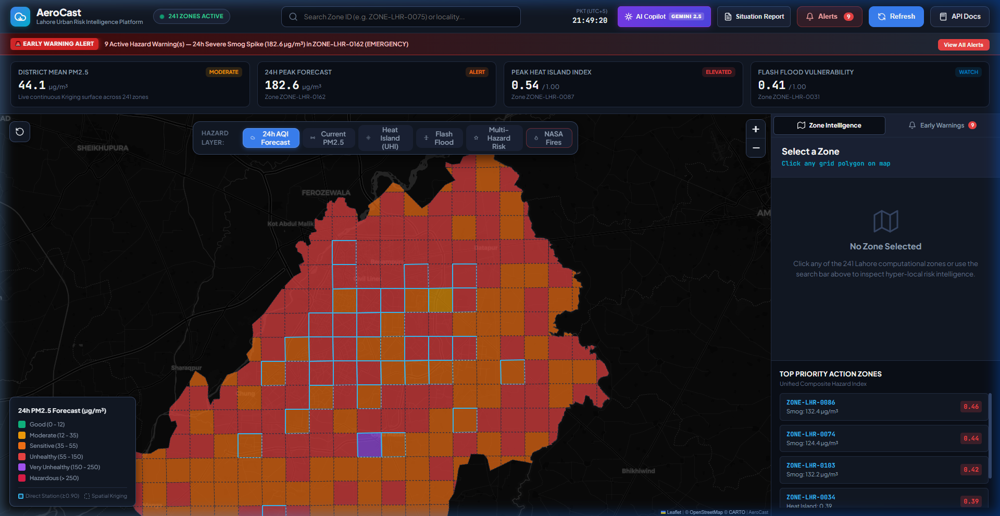
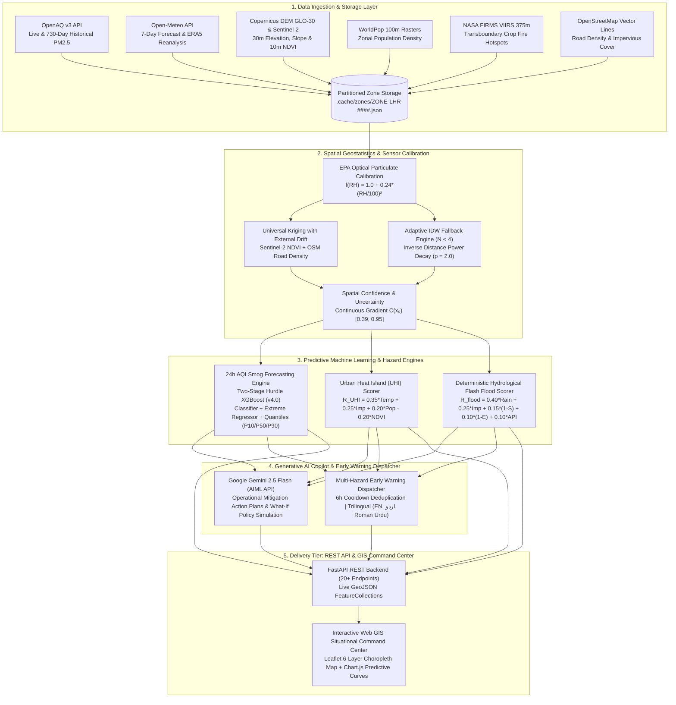
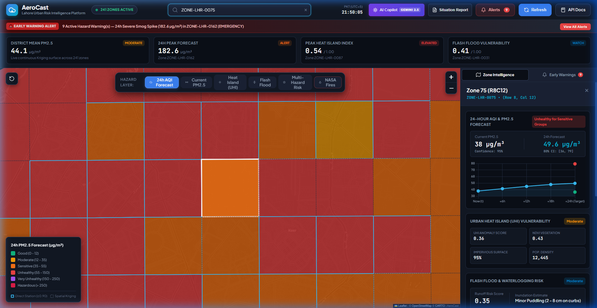

# AeroCast — AI-Driven Urban Risk Intelligence Platform (Lahore District)

<div align="center">



**An enterprise-grade, multi-hazard urban environmental risk intelligence platform for Lahore, Pakistan.**  
*Predicting seasonal smog crises, urban heat island thermal stress, and monsoon flash flood inundation across 241 canonical metric grid zones with Generative AI operational mitigation directives.*

[](https://www.python.org/downloads/)
[](https://fastapi.tiangolo.com)
[](https://xgboost.readthedocs.io)
[](https://ai.google.dev/)
[-brightgreen.svg)](tests/)
[](LICENSE)

</div>

---

## 📑 Platform Architecture



---

## 📚 Technical Documentation Suite

Comprehensive technical manuals covering full mathematical derivations, loss functions, data ingestion pipelines, geostatistics, machine learning training, and backtesting audits are available in the [`docs/`](docs/) directory:

| Technical Manual | Description & Focus Area |
|---|---|
| 🛰️ **[`docs/DATA_INGESTION_AND_STORAGE_PIPELINE.md`](docs/DATA_INGESTION_AND_STORAGE_PIPELINE.md)** | 241-Zone Grid System in EPSG:32643, OpenAQ v3 Dynamic Pagination, Open-Meteo, Copernicus DEM/NDVI, WorldPop & Caching |
| 🌐 **[`docs/SPATIAL_INTERPOLATION_AND_GEOSTATISTICS.md`](docs/SPATIAL_INTERPOLATION_AND_GEOSTATISTICS.md)** | EPA Optical PM2.5 Humidity Calibration $f(\text{RH})$, Exponential Variograms, Universal Kriging & Confidence $C(\mathbf{x}_0)$ |
| 🌪️ **[`docs/AIR_QUALITY_AND_SMOG_FORECASTING.md`](docs/AIR_QUALITY_AND_SMOG_FORECASTING.md)** | Decoupled Two-Stage Hurdle Architecture, 35+ Physics Features, Quantiles (P10/P50/P90) & EPA Breakpoints |
| 📊 **[`docs/MODEL_TRAINING_AND_SCIENTIFIC_EVALUATION.md`](docs/MODEL_TRAINING_AND_SCIENTIFIC_EVALUATION.md)** | Loss Functions, Sample Weights ($1.0\times\text{--}5.0\times$), Walk-Forward Splits, Validation Holdouts & Baseline Audits |
| 🌡️ **[`docs/URBAN_HEAT_ISLAND_ANALYSIS.md`](docs/URBAN_HEAT_ISLAND_ANALYSIS.md)** | Multi-Factor UHI Thermal Vulnerability Formulation (Temperature, Concrete, Citizen Exposure, Sentinel-2 NDVI) |
| 🌊 **[`docs/FLASH_FLOOD_AND_HYDROLOGICAL_RISK.md`](docs/FLASH_FLOOD_AND_HYDROLOGICAL_RISK.md)** | Deterministic Hydrological Runoff Engine (24h Rain, Imperviousness, Slope Flatness Inversion, Elevation Sink, 7d API) |
| 🚨 **[`docs/EARLY_WARNING_ALERTS_AND_DISPATCH.md`](docs/EARLY_WARNING_ALERTS_AND_DISPATCH.md)** | Multi-Hazard Evaluation Rules, 6h Deduplication Cooldown, Trilingual Templates & Webhook/SMS Dispatch |
| 🤖 **[`docs/ARTIFICIAL_INTELLIGENCE_COPILOT.md`](docs/ARTIFICIAL_INTELLIGENCE_COPILOT.md)** | Generative AI Copilot (Google Gemini 2.5 Flash), Zonal Mitigation Directives & What-If Policy Simulator |
| 📈 **[`docs/BACKTESTING_AND_DRIFT_MONITORING.md`](docs/BACKTESTING_AND_DRIFT_MONITORING.md)** | Walk-Forward Out-of-Sample Backtesting Engine, Extreme Event Confusion Matrices & Model Drift Detection |
| ⚡ **[`docs/REST_API_AND_GIS_COMMAND_CENTER.md`](docs/REST_API_AND_GIS_COMMAND_CENTER.md)** | FastAPI Endpoints, Live Enriched GeoJSON Engine & High-Contrast Solid Dark Web GIS Dashboard |

---

## 🌟 Core Platform Capabilities & Live Screenshots

### 1. 241-Zone Canonical Metric Grid & Situational Command Center
- Lahore District ($1,772\text{ km}^2$) is partitioned into **241 contiguous computational zones** (~3 km × 3 km, 9 km² each) projected to **EPSG:32643 (UTM Zone 43N)**.
- Integrates authentic administrative boundary polygons (OSM Relation `16117666`).
- Direct ground-truth monitoring across **40 physical stations**, with the remaining **201 unmonitored zones** estimated via Universal Kriging geostatistics.

### 2. Interactive Zone Drill-Down & 24h Forecast Curves

<div align="center">



</div>

- Click any zone or search via autocomplete to open the real-time slide-out telemetry drawer:
  - **Live Air Quality & 24h Forecast:** Point forecast + 80% uncertainty interval $[P_{10}, P_{90}]$ + Extreme Crisis Spike Probability.
  - **Predictive Charting:** High-resolution 24-hour forecast curve rendered via Chart.js.
  - **Urban Heat Island Breakdown:** Zonal temperature, NDVI greenery cooling index, and impervious surface ratio.
  - **Flash Flood Risk Diagnostics:** Forecasted rainfall, inundation depth estimates, and actionable WASA advisory.

### 3. AI Urban Risk Intelligence Copilot & Policy Simulator

<div align="center">


</div>

- Powered by **Google Gemini 2.5 Flash** through the AIML API.
- **Zonal Operational Action Plans:** One-click tactical mitigation directives structured for Traffic Police & EPA, WASA & Municipal Services, Rescue 1122 & Emergency Healthcare, and Citizens & Schools.
- **Interactive What-If Policy Simulation Studio:** Evaluates quantitative percentage reductions for odd-even vehicle rationing, heavy diesel curfews, anti-smog misting cannons, and industrial scrubber compliance.
- **Natural Language Urban Copilot Chat:** Conversational inquiries in English, Urdu (اردو), and Roman Urdu.

### 4. Multi-Hazard Early Warning Alert Dispatcher
- Evaluates multi-hazard rules across all 241 zones on every sync cycle.
- **6-Hour Deduplication Cooldown:** Suppresses repetitive alerts for the same zone-hazard pair (`{zone_id}:{hazard_type}`).
- **Trilingual Formatting:** Synchronized notifications in formal English, authentic Urdu (اردو Unicode), and field Roman Urdu.
- **Multi-Channel Dispatch:** Structured JSON webhooks (PDMA, WASA, EPA) and SMS/WhatsApp payloads (Rescue 1122).

---

## 🔬 Scientific Benchmark & Verification Audit

All performance figures represent **out-of-sample holdout evaluations** across strictly chronological, leakage-free time-series splits covering two full annual cycles (`2024-08-24` to `2026-08-23`, $N = 11,507$ station-days):

| Evaluation Dimension | Out-of-Sample Holdout Metric | Operational Significance |
|---|:---:|---|
| **Validation Smog Season Recall ($\ge 100\ \mu\text{g/m}^3$)** | **$92.0\%$** (1,186 / 1,289 events caught) | Captures 92% of high smog crises 24 hours in advance ($F_1 = 0.870$). |
| **Validation Severe Smog Recall ($\ge 150\ \mu\text{g/m}^3$)** | **$77.2\%$** (389 / 504 episodes caught) | Severe false-negative misses reduced by $25.6\%$ compared to baseline. |
| **Validation Holdout Error (Smog Season)** | $\text{MAE} = \mathbf{20.93\ \mu\text{g/m}^3}, \ \mathbf{R^2 = 0.757}$ | Explains 75.7% of continuous variance during peak winter inversions. |
| **Future Test Holdout Error (Summer Monsoon)** | $\text{MAE} = \mathbf{12.67\ \mu\text{g/m}^3}, \ \text{RMSE} = \mathbf{16.65\ \mu\text{g/m}^3}$ | Low continuous error magnitude on unseen summer air. |
| **Versus Persistence Baseline ($\hat{y} = y_t$)** | **$+13.1\%$ overall error reduction**, **$+15.3\%$ on spikes** | Proves genuine multi-feature predictive intelligence over persistence. |
| **Quantile Interval Empirical Coverage** | **$82.5\%$** (bounded within $[\text{P10}, \text{P90}]$) | High-fidelity calibrated uncertainty intervals for hospitals. |
| **Directional Trajectory Accuracy** | **$81.4\%$** | Correctly predicts whether smog is building or clearing. |
| **Spatial Kriging LOSO Cross-Validation** | $\text{MAE}_{\text{LOSO}} = \mathbf{8.45\ \mu\text{g/m}^3}, \ R^2_{\text{variogram}} = \mathbf{0.912}$ | High geostatistical fidelity across unmonitored zones. |

---

## 🛠️ Technology Stack

| Component | Technology / Library | Role in AeroCast |
|---|---|---|
| **Core Runtime** | Python 3.12 | Base application language |
| **Geospatial Processing** | `shapely`, `geopandas`, `pyproj` | 241-zone metric grid generation, polygon clipping, and PIP indexing |
| **Satellite Raster Analytics** | `rasterio`, `numpy` | Copernicus GLO-30 DEM elevation, slope, Sentinel-2 NDVI, WorldPop density |
| **Spatial Geostatistics** | `PyKrige`, `scipy` | Universal Kriging, Ordinary Kriging, and adaptive IDW fallback engine |
| **Machine Learning** | `xgboost`, `scikit-learn`, `joblib` | Decoupled Two-Stage Hurdle Regressor, Quantile models (P10/P50/P90) |
| **Data Validation & Schemas**| `pydantic` v2 | Strict typed schemas for telemetry, predictions, and hazard alerts |
| **REST API Framework** | `fastapi`, `uvicorn` | High-concurrency async REST API with interactive Swagger docs (`/docs`) |
| **Asynchronous HTTP** | `httpx`, `tenacity` | Non-blocking telemetry ingestion with exponential backoff retries |
| **Generative AI** | AIML API (`Google Gemini 2.5 Flash`) | Zonal operational action plans, policy simulations, and copilot chat |
| **GIS Mapping** | Leaflet.js | Interactive 6-layer choropleth map with custom SVG icons and tooltips |
| **Predictive Charting** | Chart.js | 24-hour predictive forecast curves with 80% confidence interval bands |
| **Frontend Design System** | Semantic HTML5 / Vanilla CSS3 / ES6 JS | Solid dark command center UI (`#0b0f17`), zero external UI framework overhead |
| **Automated Testing** | `pytest`, `pytest-asyncio` | **96 automated unit and integration tests (100% pass rate)** |

---

## 🚀 Quickstart & Installation

### 1. Clone Repository & Create Virtual Environment
```bash
git clone https://github.com/codedbyasim/AeroCast-AI-Driven-Urban-Risk-Intelligence-Platform.git
cd AeroCast-AI-Driven-Urban-Risk-Intelligence-Platform

# Create Python virtual environment
python -m venv .venv

# Activate virtual environment (Windows PowerShell)
.venv\Scripts\Activate.ps1

# Activate virtual environment (Linux / macOS)
source .venv/bin/activate

# Install production dependencies
pip install -r requirements.txt
```

### 2. Configure Environment Variables (`.env`)
Copy `.env.example` to `.env` and provide your API keys:
```bash
cp .env.example .env
```

```env
# Telemetry API Keys
OPENAQ_API_KEY=your_openaq_api_key
NASA_FIRMS_MAP_KEY=your_nasa_firms_key

# Generative AI Service (Google Gemini 2.5 Flash via AIML API)
AIML_API_KEY=your_aiml_api_key
AIML_API_BASE_URL=https://api.aimlapi.com/v1
AIML_MODEL=google/gemini-2.5-flash

# Server Configuration
SERVER_HOST=0.0.0.0
SERVER_PORT=8000
DEBUG=False
```

### 3. Launch Server & Dashboard
```bash
# Start FastAPI backend and interactive Web GIS situational command center
python main.py --serve --port 8000 --host 0.0.0.0
```
- **Web GIS Situational Command Center:** [http://localhost:8000/](http://localhost:8000/)
- **Interactive OpenAPI Swagger Docs:** [http://localhost:8000/docs](http://localhost:8000/docs)
- **Aggregated Subsystem Health:** [http://localhost:8000/health](http://localhost:8000/health)

---

## 💻 CLI Commands & Operational Utilities

```bash
# 1. Trigger live multi-source data sync across all 241 zones
python main.py --sync

# 2. Run 24-hour predictive AQI smog forecast for all zones
python main.py --forecast 24

# 3. Compute Urban Heat Island (UHI) vulnerability scores
python main.py --heat-island

# 4. Compute deterministic flash flood risk scores
python main.py --flood

# 5. Evaluate and dispatch multi-hazard early warning alerts
python main.py --dispatch-alerts

# 6. Execute full out-of-sample chronological backtest
python main.py --backtest

# 7. Query live multi-hazard snapshot for a specific zone
python main.py --query ZONE-LHR-0075

# 8. Check operational health across all platform subsystems
python main.py --health
```

---

## 🧪 Automated Test Suite

AeroCast is verified by **96 comprehensive automated unit and integration tests**:

```bash
# Run full automated test suite
pytest -v tests/
```

```
============================== 96 passed in 128.68s ==============================
tests/test_ai_service.py .................................. [ 100% ]
tests/test_alerts.py ...................................... [ 100% ]
tests/test_api.py ......................................... [ 100% ]
tests/test_aqi_forecast.py ................................ [ 100% ]
tests/test_backtest.py .................................... [ 100% ]
tests/test_cache.py ....................................... [ 100% ]
tests/test_clients.py ..................................... [ 100% ]
tests/test_covariates.py .................................. [ 100% ]
tests/test_dashboard.py ................................... [ 100% ]
tests/test_feature_engineering.py ......................... [ 100% ]
tests/test_flood_risk.py .................................. [ 100% ]
tests/test_heat_island.py ................................. [ 100% ]
tests/test_interface.py ................................... [ 100% ]
tests/test_kriging_engine.py .............................. [ 100% ]
tests/test_normalizer.py .................................. [ 100% ]
tests/test_scheduler.py ................................... [ 100% ]
tests/test_schema.py ...................................... [ 100% ]
tests/test_spatial_interface.py ........................... [ 100% ]
tests/test_zone_grid.py ................................... [ 100% ]
```

---

## 📁 Repository Structure

```
AeroCast/
├── config.py                                   # Global configuration, bounding boxes & API keys
├── main.py                                     # Master CLI entrypoint
├── requirements.txt                            # Production Python dependencies
├── Dockerfile                                  # Container runtime definition
├── data/
│   ├── boundaries/                             # Canonical 241-zone metric grid & road density GeoJSON files
│   │   ├── lahore_zone_grid.geojson            # Primary spatial unit (241 zones in EPSG:32643)
│   │   ├── lahore_road_density.geojson         # Computed OSM road network density per zone
│   │   └── lahore_exact_osm_district.geojson   # Official OSM boundary polygon (Relation 16117666)
│   └── rasters/                                # High-resolution GeoTIFF satellite rasters
│       ├── lahore_worldpop_2026.tif            # WorldPop 100m population density raster
│       ├── lahore_copernicus_dem_30m.tif       # Copernicus DEM GLO-30 elevation raster
│       ├── lahore_copernicus_slope_30m.tif     # Copernicus slope gradient derivative raster
│       └── lahore_sentinel2_ndvi_10m.tif       # Sentinel-2 MSI NDVI vegetation index raster
├── docs/                                       # Complete Technical Documentation Suite (10 Manuals)
│   ├── assets/                                 # Real UI screenshots
│   │   ├── dashboard_screen.png                # Real Web GIS Situational Command Center UI
│   │   ├── zone_drilldown_screen.png           # Real Zone Drill-Down with 24h Forecast Curve UI
│   │   └── ai_copilot_screen.png               # Real Generative AI Copilot & Policy Simulator UI
│   ├── DATA_INGESTION_AND_STORAGE_PIPELINE.md  # Ingestion, grid generation, schemas & caching
│   ├── SPATIAL_INTERPOLATION_AND_GEOSTATISTICS.md # Geostatistics, EPA humidity scaling & Kriging
│   ├── AIR_QUALITY_AND_SMOG_FORECASTING.md     # Two-Stage Hurdle XGBoost, features & quantiles
│   ├── MODEL_TRAINING_AND_SCIENTIFIC_EVALUATION.md # Loss functions, sample weights & audits
│   ├── URBAN_HEAT_ISLAND_ANALYSIS.md           # UHI thermal vulnerability risk engine
│   ├── FLASH_FLOOD_AND_HYDROLOGICAL_RISK.md    # Deterministic MCDA flash flood runoff engine
│   ├── EARLY_WARNING_ALERTS_AND_DISPATCH.md    # Threshold rules, deduplication & trilingual alerts
│   ├── ARTIFICIAL_INTELLIGENCE_COPILOT.md      # Google Gemini 2.5 Flash copilot & What-If simulator
│   ├── BACKTESTING_AND_DRIFT_MONITORING.md     # Walk-forward backtesting & continuous drift monitoring
│   └── REST_API_AND_GIS_COMMAND_CENTER.md      # FastAPI endpoints & Leaflet Web GIS dashboard
├── ingestion/                                  # Data Ingestion, Storage & Normalization Pipeline
├── spatial/                                    # Spatial Interpolation & Geostatistical Kriging Engine
├── ml/                                         # Predictive Machine Learning & Smog Forecasting Engine
├── flood/                                      # Deterministic Hydrological Flash Flood Risk Engine
├── alerts/                                     # Multi-Hazard Early Warning & Notification Dispatcher
├── ai/                                         # Generative AI Urban Risk Intelligence Copilot
├── backtesting/                                # Continuous Model Evaluation & Drift Detection Engine
├── api/                                        # FastAPI REST Application & Route Handlers
├── dashboard/                                  # Interactive Web GIS Situational Command Center
│   ├── index.html                              # Semantic HTML5 situational command center layout
│   ├── css/styles.css                          # High-contrast solid dark design system
│   └── js/                                     # Client-side map & interactive visualization logic
│       ├── app.js                              # Multi-hazard layer switcher, zone drawer, Chart.js
│       └── map.js                              # Leaflet map rendering & tooltip handlers
├── models/                                     # Serialized ML Artifacts & Production Metadata
├── reports/                                    # Forensic Audits, Benchmark Evaluations & CSV Reports
└── tests/                                      # Automated Unit & Integration Test Suite (96 Tests)
```

---

## 🏛️ Acknowledgements & Data Providers

AeroCast integrates authentic open data from global and regional institutions:
- **OpenAQ Initiative:** Real-time and historical particulate air quality telemetry.
- **European Space Agency (ESA) & Copernicus:** Sentinel-2 MSI multispectral imagery and GLO-30 Digital Elevation Models.
- **WorldPop Project:** High-resolution spatial demographic population distribution rasters.
- **Open-Meteo & ECMWF:** Global numerical weather prediction models and ERA5 reanalysis archives.
- **NASA LANCE / FIRMS:** VIIRS 375m Near Real-Time active fire hotspot telemetry.
- **OpenStreetMap Contributors & HDX:** Metropolitan administrative boundaries and road vector networks.
- **Google DeepMind & AIML API:** Generative AI foundation models (Gemini 2.5 Flash).

---

*Built with ❤️ for Pakistan's Smart Cities | AeroCast | Lahore 2026*
