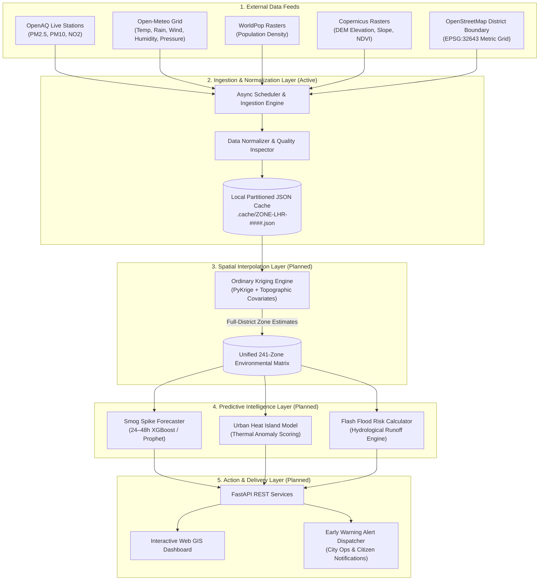

# AeroCast — AI-Driven Urban Risk Intelligence Platform

> **Predictive hyper-local early warning for smog spikes, urban heat islands, and flash flood risk across Lahore District.**  
> Built for the **Smart City Hackathon Lahore 2026** _(Theme: City Intelligence)_.

---

## 1. Project Overview

Lahore is among the world's most vulnerable megacities to environmental shocks. Every winter, a thick blanket of hazardous smog grips the district, pushing air quality index (AQI) levels into hazardous territory. During the summer months, dense concrete corridors amplify heat into dangerous urban heat islands, while sudden monsoon downpours overwhelm drainage infrastructure and trigger localized flash flooding.

Traditional city monitoring systems react **after** disaster strikes — when hospitals are already flooded with respiratory patients or streets are already submerged. **AeroCast** shifts city operations from reactive disaster management to **proactive predictive intelligence**.

By dividing Lahore District into a uniform computational grid of **241 metric zones (~3 km × 3 km each)**, AeroCast continuously aggregates real-time air quality monitors, satellite weather forecasts, population density, and topographic elevation models. The platform predicts hazard conditions **24 to 48 hours in advance**, giving city administrators, emergency services, and citizens actionable lead time to take preventative measures: deploying targeted traffic restrictions, opening cooling centers, or pre-clearing vulnerable drainage basins before conditions become critical.

---

## 2. Architecture Diagram



---

## 3. Tech Stack

| Category                          | Technology / Library                 | Status  | Purpose                                                                     |
| --------------------------------- | ------------------------------------ | ------- | --------------------------------------------------------------------------- |
| **Core Language**                 | Python 3.12                          | In Use  | Primary language across all ingestion, modeling, and API services           |
| **Geospatial & Spatial Grid**     | `shapely`, `geopandas`, `pyproj`     | In Use  | UTM Zone 43N (EPSG:32643) zone grid geometry, clipping, centroid analysis   |
| **Raster Processing**             | `rasterio`, `numpy`                  | In Use  | Zonal population, DEM elevation, slope, and Sentinel-2 NDVI raster sampling |
| **Async Networking & Resilience** | `httpx`, `tenacity`                  | In Use  | Asynchronous HTTP polling with exponential backoff and connection retries   |
| **Data Modeling & Validation**    | `pydantic` (v2)                      | In Use  | Strict schema definitions, timestamp parsing, and data quality tracking     |
| **Job Scheduling**                | `apscheduler`                        | In Use  | Background periodic polling for live air quality and weather forecasts      |
| **Testing & Quality Assurance**   | `pytest`, `pytest-asyncio`           | In Use  | Automated unit and integration test suite                                   |
| **Spatial Interpolation**         | `PyKrige`, `scipy`                   | Planned | Ordinary Kriging spatial interpolation across non-sensor zones              |
| **Predictive Machine Learning**   | `xgboost`, `prophet`, `scikit-learn` | Planned | Time-series 24–48h smog forecasting and thermal anomaly classification      |
| **REST API Layer**                | `fastapi`, `uvicorn`                 | Planned | High-performance asynchronous API endpoints serving zone risk scores        |
| **Data Storage**                  | Local JSON Cache (`.cache/`)         | In Use  | Partitioned file cache with stale-data fallback and confidence tracking     |
| **Production Storage**            | PostgreSQL / PostGIS                 | Planned | Long-term time-series and spatial database storage                          |
| **Containerization**              | Docker                               | In Use  | Containerized execution environment defined in `Dockerfile`                 |

---

## 4. Data & Storage Design

### The 241-Zone Metric Grid

Rather than relying on administrative boundaries (Union Councils or Tehsils), which suffer from irregular shapes, outdated boundaries, and inconsistent geometric sizes, AeroCast operates on a **uniform metric grid**:

- **Grid Structure**: 241 regular hexagonal/square cells (~3 km × 3 km, ~9 km² each), clipped cleanly to Lahore District's authentic OpenStreetMap boundary.
- **Coordinate Reference System**: Projected from WGS 84 (`EPSG:4326`) into **UTM Zone 43N (`EPSG:32643`)** for millimeter-accurate distance and area computations.
- **Zone Identifier**: Canonical format `ZONE-LHR-0001` through `ZONE-LHR-0241`.
- **Properties per Zone**: `zone_id`, `zone_name`, `grid_row`, `grid_col`, `area_sqkm`, `centroid_lat`, `centroid_lon`, `district`.

### Normalized Record Schema

Every observation stored and passed through the pipeline conforms to a standardized structure validated by Pydantic:

```json
{
  "schema_version": "1.1",
  "source": "OpenAQ | Open-Meteo",
  "zone_id": "ZONE-LHR-0001",
  "timestamp_utc": "2026-08-22T15:14:17Z",
  "metrics": {
    "aqi_pm25": 145.2,
    "aqi_pm10": 180.5,
    "no2_ppb": 32.0,
    "temperature_c": 30.1,
    "rainfall_mm_forecast": 0.0,
    "wind_speed_kmh": 4.5,
    "relative_humidity_percent": 77.0,
    "surface_pressure_hpa": 975.8
  },
  "spatial_context": {
    "elevation_m": 224.6,
    "slope_percent": 2.5,
    "impervious_surface_ratio": 0.65,
    "ndvi_index": 0.46,
    "population_density_per_sqkm": 4710.87,
    "grid_row": 1,
    "grid_col": 14,
    "zone_name": "Zone 1 (R1C14)",
    "centroid_lat": 31.6887,
    "centroid_lon": 74.4419
  },
  "data_quality": {
    "interpolated": true,
    "confidence_score": 0.7,
    "stale": false,
    "notes": "no direct AQI station in this zone — using nearest-zone weather context only, AQI pending spatial interpolation; using nearest weather grid point (Zone 38); spatial context from synthetic placeholder rasters"
  }
}
```

### Storage Architecture

- **Current MVP Storage**: Partitioned local JSON cache stored under `.cache/`. Each zone has its own JSON file containing the latest snapshot along with historical logs under `.cache/historical/`.
- **Stale Fallback & Provenance**: If an upstream API goes offline, the cache provides the last known good snapshot, marks `stale: true`, reduces `confidence_score` (e.g. to `0.50`), and appends diagnostic provenance notes.
- **Future Database Path**: The local JSON cache is designed as a direct drop-in precursor to PostgreSQL + PostGIS for production scalability.

---

## 5. Implementation Plan

The platform is structured into clean, modular tiers:

1. **Data Ingestion & Spatial Foundation**: Ingests heterogeneous data feeds (live air quality sensors, weather forecasts, elevation models, population rasters) and maps them cleanly into the 241-zone metric grid.
2. **Spatial Interpolation Engine**: Solves the sensor sparsity problem. Ground monitoring stations exist in only ~17% of Lahore's zones; Ordinary Kriging with terrain and vegetation covariates fills the remaining ~83% of zones with continuous risk estimates and variance bounds.
3. **Predictive Intelligence Models**:
   - **Smog Forecast**: Multi-variate machine learning model (XGBoost) predicting PM2.5 and PM10 spikes 24–48 hours ahead based on temperature inversions, wind stagnation, and humidity.
   - **Urban Heat Island Index**: Surface temperature anomaly modeling combining Copernicus NDVI vegetation deficits, high impervious surface ratios, and weather forecasts.
   - **Flash Flood Risk Engine**: Hydrological runoff model calculating flood likelihood (`Rainfall Intensity × Slope Inversion × Impervious Surface Ratio`).
4. **Risk Intelligence & Validation**: Combines hazard predictions into a composite risk tier (Low, Moderate, High, Severe) per zone, with automated backtesting against historical smog events to measure MAE, RMSE, and R².
5. **API & Data Services**: High-throughput FastAPI REST backend exposing zone-level risk scores, historical trends, and geo-query endpoints for city integrations.
6. **Command Dashboard & Alerts**: Web GIS interactive dashboard with live choropleth maps, zone risk inspection cards, and automated alerting for emergency dispatchers.

---

## 6. 5-Day Build Roadmap

### Day 1 — Ingestion & Storage Foundation — ✅ Complete

- **Module M1 (Data Ingestion Layer)**: Canonical 241-zone metric grid dataset (`data/boundaries/lahore_zone_grid.geojson`), live asynchronous clients for OpenAQ and Open-Meteo, WorldPop population density and Copernicus DEM/NDVI raster zonal processors, nearest-neighbor weather matching, and normalization pipeline.
- **Module M10 (Storage & Cache Engine)**: Partitioned JSON caching per zone (`.cache/ZONE-LHR-####.json`), stale-data fallback mechanism, diagnostic data-quality confidence tracking, and 2-year historical archival.
- **Diagnostics & Tests**: Complete 25-test automated test suite (`pytest`) with 100% pass rate.

### Day 2 — Spatial Interpolation Engine — [Upcoming]

- **Module M2 (Spatial Interpolation Engine)**:
  - Implement Ordinary Kriging using `PyKrige` over the 241-zone grid to interpolate PM2.5, PM10, NO2, and temperature from sparse monitoring stations into full district coverage.
  - Incorporate topographic elevation, slope, and Sentinel-2 NDVI vegetation index as spatial drift covariates.
  - Calculate spatial kriging variance and uncertainty bounds to assign rigorous confidence scores to every zone.

### Day 3 — Predictive Machine Learning & Hazard Engines — [Upcoming]

- **Module M3 (Predictive AQI & Urban Heat Island Engine)**:
  - Train 24-hour and 48-hour forward multi-step time-series forecasting models (XGBoost) using historical environmental datasets.
  - Calculate Urban Heat Island (UHI) anomaly scores combining Copernicus NDVI deficits, impervious surface ratios, and temperature forecasts.
- **Module M4 (Flash Flood Risk Calculation Engine)**:
  - Implement deterministic hydrological runoff risk scoring combining precipitation forecasts, slope inversions, and surface imperviousness ratios.

### Day 4 — Model Evaluation, External Adapters & REST API — [Upcoming]

- **Module M8 (Backtesting & Model Evaluation Engine)**:
  - Automated backtesting engine validating predictions against historical seasonal smog peaks and heavy rainfall events (evaluating MAE, RMSE, R²).
- **Module M5 (Government Feed Adapter)**:
  - Integration adapter for Punjab EPA, PDMA, and Rescue 1122 telemetry feeds.
- **Module M9 (REST API Layer)**:
  - High-performance FastAPI backend exposing zone risk scores, historical time-series, geo-queries, and health status endpoints.

### Day 5 — Web GIS Dashboard & Early Warning Dispatcher — [Upcoming]

- **Module M6 (GIS Web Dashboard)**:
  - Interactive situational Web GIS command center with real-time risk choropleths, 24–48h time-slider forecasts, and zone drill-down cards.
- **Module M7 (Alert & Notification Dispatcher)**:
  - Multi-hazard threshold triggers, automated webhooks, and SMS/Email dispatching for emergency operations and public advisories.
- **Final Polish & Delivery**: End-to-end hackathon demonstration benchmarks and system verification.

---

## 7. Quickstart Guide

### Prerequisites

- Python 3.10+ (Python 3.12 recommended)
- Git

### Installation

```bash
# Clone repository
git clone https://github.com/YourOrg/aerocast.git
cd aerocast

# Create virtual environment
python -m venv .venv
source .venv/bin/activate   # On Windows: .venv\Scripts\activate

# Install dependencies
pip install -r requirements.txt
```

### Running Ingestion & Sync

```bash
# Perform a live ingestion sync across all 241 zones
python main.py --sync

# Query a specific zone
python main.py --query ZONE-LHR-0001

# Inspect ingestion health status
python main.py --health

# Fetch 2-year historical training archive
python main.py --sync-historical --days 730
```

### Running Tests

```bash
pytest -v tests/
```
