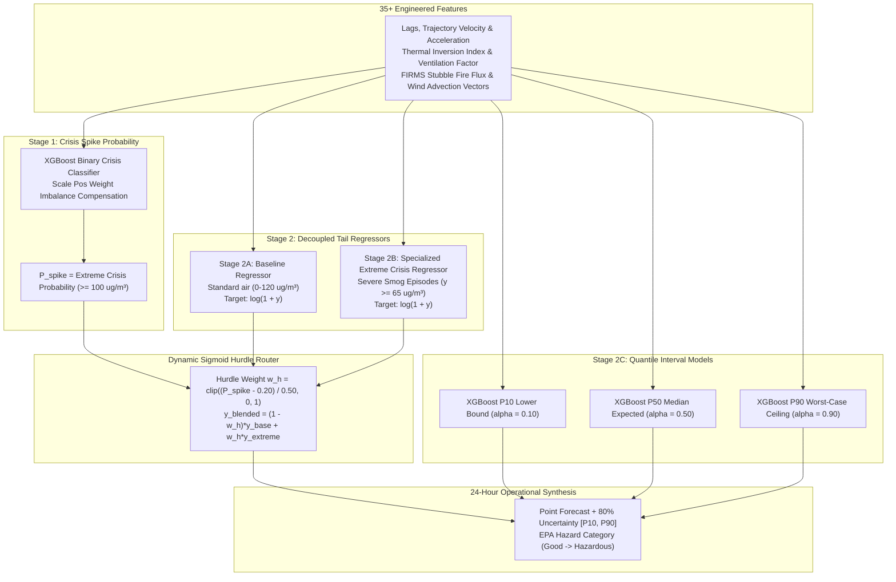

# Predictive Machine Learning & 24-Hour Smog Forecasting Engine Manual

**Document Version:** 4.0.0  
**Target Metropolitan Area:** Lahore District, Punjab, Pakistan  
**Downstream Consumers:** Early Warning & Notification Dispatcher, Generative AI Intelligence Copilot, REST API, Web GIS Dashboard  
**Model Artifacts:** `models/aqi_xgb_24h_v4.0.joblib`, `models/aqi_xgb_extreme_v4.0.joblib`, `models/aqi_xgb_classifier_v4.0.joblib`, `models/aqi_xgb_p10_v4.0.joblib`, `models/aqi_xgb_p50_v4.0.joblib`, `models/aqi_xgb_p90_v4.0.joblib`, `models/metadata_v4.json`  

---

## 1. Executive Summary & Problem Context

Lahore suffers from some of the most hazardous seasonal smog episodes globally, with particulate concentrations ($\text{PM}_{2.5}$) exceeding $300\text{--}600\ \mu\text{g/m}^3$ during winter atmospheric temperature inversions (November through February). Standard unweighted regression models trained on annual data frequently fail because clean summer days overwhelm the loss function, leading to catastrophic underprediction of extreme smog peaks ($\text{MAE} > 45\ \mu\text{g/m}^3$ on severe days).

The **Predictive Machine Learning & Smog Forecasting Engine** solves this via a **Decoupled Two-Stage Hurdle Architecture with Extreme Tail Specialization and Native Quantile Uncertainty Estimation**:
1. **Stage 1 (Binary Crisis Classifier):** Identifies the probability of an extreme smog spike ($\text{PM}_{2.5} \ge 100\ \mu\text{g/m}^3$) 24 hours in advance.
2. **Stage 2A (Baseline Regressor):** Accurately predicts standard baseline and moderate pollution concentrations ($0\text{--}120\ \mu\text{g/m}^3$) on log-transformed targets.
3. **Stage 2B (Specialized Extreme Crisis Regressor):** Trained exclusively on elevated episodes ($\ge 65\ \mu\text{g/m}^3$) to capture non-linear thermal inversion dynamics without dilution from clean days.
4. **Stage 2C (Native Quantile Regressors):** Generates calibrated probabilistic intervals ($\text{P10}$ lower bound, $\text{P50}$ median expected, $\text{P90}$ worst-case operational ceiling).
5. **Dynamic Sigmoid Hurdle Router:** Blends baseline and extreme regressors dynamically as crisis probability rises.



---

## 2. Decoupled Two-Stage Hurdle Architecture

### 2.1 Stage 1: Calibrated XGBoost Binary Crisis Classifier
The Stage 1 classifier evaluates whether atmospheric and spatial conditions at timestamp $t$ will trigger an extreme pollution crisis ($\text{PM}_{2.5} \ge 100.0\ \mu\text{g/m}^3$) at timestamp $t + 24\text{h}$.

#### Objective & Imbalance Compensation:
$$\mathcal{L}_{\text{cls}}(\theta) = -\sum_{i=1}^{N} \left[ w_{\text{pos}} y_i \log(\hat{p}_i) + (1 - y_i) \log(1 - \hat{p}_i) \right]$$

Where:
- $y_i = \mathbb{I}(y_{\text{true}, i} \ge 100.0\ \mu\text{g/m}^3)$.
- $w_{\text{pos}} = \text{clip}\left(\frac{N_{\text{neg}}}{N_{\text{pos}}}, \ 3.0, \ 10.0\right)$ compensates for class imbalance during clean seasons.
- $\hat{p}_i \in [0.0, 1.0]$ represents the crisis spike probability $P_{\text{spike}}$.

---

### 2.2 Stage 2A: Baseline Regressor (Standard Atmospheric Conditions)
The baseline regressor is trained on all augmented samples using a logarithmic target transformation to stabilize high variance:

$$z_i = \log(1 + y_i)$$

$$\mathcal{L}_{\text{base}}(\theta) = \sum_{i=1}^{N} w_i \cdot \left( z_i - \hat{z}_{i} \right)^2 + \Omega(f_k)$$

Where sample weights $w_i$ emphasize higher ranges without destabilizing low baseline values:

$$w_i = \begin{cases} 
1.0 & \text{if } y_i \le 50.0\ \mu\text{g/m}^3 \\
1.5 & \text{if } 50.0 < y_i \le 100.0\ \mu\text{g/m}^3 \\
3.0 & \text{if } 100.0 < y_i \le 150.0\ \mu\text{g/m}^3 \\
5.0 & \text{if } y_i > 150.0\ \mu\text{g/m}^3
\end{cases}$$

The inverted physical prediction is:
$$\hat{y}_{\text{base}} = \exp\left(\hat{z}_{\text{base}}\right) - 1$$

---

### 2.3 Stage 2B: Specialized Extreme Crisis Regressor
To capture non-linear winter thermal trapping without dilution from clean days, Stage 2B is trained exclusively on elevated samples ($y_i \ge 65.0\ \mu\text{g/m}^3$):

$$\mathcal{L}_{\text{extreme}}(\theta) = \sum_{i \in \{k \mid y_k \ge 65\}} w_{\text{ext}, i} \cdot \left( \log(1 + y_i) - \hat{z}_{\text{ext}, i} \right)^2 + \Omega(f_k)$$

With aggressive tail sample weighting:
$$w_{\text{ext}, i} = \begin{cases} 
1.0 & \text{if } 65.0 \le y_i \le 100.0\ \mu\text{g/m}^3 \\
2.5 & \text{if } 100.0 < y_i \le 150.0\ \mu\text{g/m}^3 \\
5.0 & \text{if } y_i > 150.0\ \mu\text{g/m}^3
\end{cases}$$

---

### 2.4 Stage 2C: Native Quantile Regressors (P10, P50, P90)
To produce calibrated uncertainty intervals without assuming Gaussian residual errors, three quantile regression models are trained directly on asymmetric pinball loss:

$$\mathcal{L}_{\alpha}(z_i, \hat{z}_i) = \max\left( \alpha (z_i - \hat{z}_i), \ (\alpha - 1)(z_i - \hat{z}_i) \right)$$

1. **P10 Lower Bound ($\alpha = 0.10$):** 90% confidence that actual pollution will exceed this floor.
2. **P50 Median Expected ($\alpha = 0.50$):** Median risk prediction.
3. **P90 Worst-Case Operational Ceiling ($\alpha = 0.90$):** 90% confidence that actual pollution will not exceed this ceiling. Essential for emergency hospital readiness.

#### Monotonicity Enforcement:
$$\text{P10} = \max(1.0, \ \text{P10}_{\text{raw}})$$
$$\text{P50} = \max(\text{P10} + 1.0, \ \text{P50}_{\text{raw}})$$
$$\text{P90} = \max(\text{P50} + 2.0, \ \text{P90}_{\text{raw}})$$

---

### 2.5 Dynamic Sigmoid Hurdle Router Formulation
The final operational point forecast $\hat{y}_{\text{forecast}}$ is synthesized dynamically:

#### 1. Dynamic Hurdle Transition Weight:
$$w_{\text{hurdle}} = \text{clip}\left(\frac{P_{\text{spike}} - 0.20}{0.70 - 0.20}, \ 0.0, \ 1.0\right)$$

- When $P_{\text{spike}} \le 0.20$: $w_{\text{hurdle}} = 0.0$ ($100\%$ baseline regressor).
- When $P_{\text{spike}} \ge 0.70$: $w_{\text{hurdle}} = 1.0$ ($100\%$ specialized extreme crisis regressor).
- When $0.20 < P_{\text{spike}} < 0.70$: Smooth linear transition between regimes.

$$\hat{y}_{\text{blended}} = (1 - w_{\text{hurdle}}) \cdot \hat{y}_{\text{base}} + w_{\text{hurdle}} \cdot \hat{y}_{\text{extreme}}$$

#### 2. Risk-Weighted Point Forecast Synthesis:
$$\hat{y}_{\text{forecast}} = \begin{cases} 
0.50 \cdot \hat{y}_{\text{blended}} + 0.20 \cdot \text{P50} + 0.30 \cdot \text{P90} & \text{if } P_{\text{spike}} > 0.40 \quad (\text{Crisis Mode}) \\
0.70 \cdot \hat{y}_{\text{blended}} + 0.30 \cdot \text{P50} & \text{if } P_{\text{spike}} \le 0.40 \quad (\text{Normal Mode})
\end{cases}$$

---

## 3. Complete Feature Engineering Formulations (35+ Features)

All 35+ engineered features are strictly backward-looking ($t' \le t$) with **zero future lookahead leakage**.

### 3.1 Particulate Autoregressive Lags & Dynamics
1. **Current Concentration:** $y_t$ ($\text{PM}_{2.5}$ at forecast origin time).
2. **24-Hour Lag:** $y_{t-24\text{h}}$
3. **48-Hour Lag:** $y_{t-48\text{h}}$
4. **7-Day Cyclical Weekly Lag:** $y_{t-7\text{d}}$ (captures recurring weekly traffic and commercial cycles).
5. **24-Hour Difference:** $\Delta y_{24\text{h}} = y_t - y_{t-24\text{h}}$
6. **Velocity Trajectory Ratio:**
   $$\text{Trajectory Ratio} = \frac{y_t}{y_{t-24\text{h}} + 1.0}$$
7. **Smog Spike Acceleration Rate:**
   $$\text{Acceleration} = (y_t - y_{t-24\text{h}}) - (y_{t-24\text{h}} - y_{t-48\text{h}})$$

### 3.2 Rolling Temporal Statistics & Persistence
8. **3-Day Rolling Mean:** $\mu_{24\text{h}} = \frac{1}{3}\sum_{k=1}^3 y_{t - 24k\text{h}}$
9. **7-Day Rolling Mean:** $\mu_{72\text{h}} = \frac{1}{7}\sum_{k=1}^7 y_{t - 24k\text{h}}$
10. **3-Day Rolling Max:** $\max_{24\text{h}} = \max_{k \in \{1,2,3\}} y_{t - 24k\text{h}}$
11. **7-Day Rolling Max:** $\max_{72\text{h}} = \max_{k \in \{1,\dots,7\}} y_{t - 24k\text{h}}$
12. **7-Day Volatility ($\sigma$):**
    $$\sigma_{72\text{h}} = \sqrt{\frac{1}{7}\sum_{k=1}^7 (y_{t - 24k\text{h}} - \mu_{72\text{h}})^2}$$
13. **Consecutive Elevated Days:** Count of continuous preceding days with $y \ge 75.0\ \mu\text{g/m}^3$.

### 3.3 Meteorology, Boundary Layer & Thermal Inversion Trapping
14. **Temperature Extremes:** $T_{\max}, T_{\min}$
15. **Diurnal Temperature Range:** $\Delta T_{\text{diurnal}} = T_{\max} - T_{\min}$
16. **Precipitation Sum:** $P_{\text{precip}}$ (mm)
17. **Wind Speed:** $v_{\text{wind}}$ (km/h)
18. **Relative Humidity:** $\text{RH}$ ($\%$) — drives hygroscopic aerosol growth and winter fog droplet formation.
19. **Atmospheric Stagnation Index:**
    $$\text{Stagnation} = \frac{T_{\max} - T_{\min}}{\max(v_{\text{wind}}, \ 0.5)}$$
20. **Ventilation Factor:**
    $$\text{VF} = v_{\text{wind}} \cdot (T_{\text{mean}} + 10.0)$$
21. **Stagnation-Smog Interaction Index:**
    $$\text{Interaction} = \text{Stagnation} \cdot \mu_{24\text{h}}$$
22. **Atmospheric Ventilation Index:**
    $$\text{AVI} = v_{\text{wind}} \cdot \frac{\Delta T_{\text{diurnal}}}{2.0}$$
23. **Thermal Inversion Trapping Index:**
    $$\text{Inversion Index} = \left( \frac{\text{Stagnation}}{\max(5.0, \ T_{\text{mean}} + 5.0)} \right) \cdot \left( \mathbb{I}_{\text{smog}} \cdot 2.5 + 0.3 \right)$$

### 3.4 Satellite Stubble Burning & Regional Smoke Flux
24. **NASA FIRMS Satellite Fire Count:** Active crop stubble fire hotspots detected in the transboundary agricultural corridor.
25. **NASA FIRMS Total Fire Radiative Power (FRP):** Cumulative radiative thermal energy ($\text{MW}$).
26. **Upwind Transboundary Smoke Flux Index:**
    $$\text{Smoke Flux} = \left( \text{FireCount} \cdot \frac{\text{FRP}}{100.0} \cdot \max(0, \cos(\theta_{\text{wind}} - 90^\circ)) \right) \cdot \left(1.0 + \frac{v_{\text{wind}}}{15.0}\right)$$

### 3.5 Spatial Neighborhood & Advection Drift Vectors
27. **Nearest $k$-Sensor Max ($k=3$):** $\max_{j \in \mathcal{N}_3(i)} s_j$
28. **Nearest $k$-Sensor Distance-Weighted Mean:**
    $$\text{Spatial Mean} = \frac{\sum_{j=1}^3 \frac{s_j}{\max(0.1, d_{ij})}}{\sum_{j=1}^3 \frac{1}{\max(0.1, d_{ij})}}$$
29. **Spatial Pollution Gradient:** $\text{Gradient} = y_{i,t} - \max_{j \in \mathcal{N}_3(i)} s_j$
30. **Wind Downwind Transport Vector:** Computes advection from upwind source stations within $15\text{ km}$:
    $$\text{Transport} = \left( \frac{\sum_{s} s_{\text{pm25}} \cdot \cos^2(\phi_s) \cdot \frac{1}{d_s + 1.0}}{\sum_s \cos^2(\phi_s) \cdot \frac{1}{d_s + 1.0}} \right) \cdot \min\left(2.0, \ \frac{v_{\text{wind}}}{15.0}\right) \cdot 0.25$$
31. **Spatial Estimation Error Variance:** $\sigma_K^2$ (from Kriging geostatistical engine).
32. **Distance to Nearest Physical Station:** $d_{\min}$ (km).

### 3.6 Seasonal Harmonic Cyclical Encodings
33. **Sine Day of Year:** $\sin\left(\frac{2\pi \cdot d_{\text{oy}}}{365.25}\right)$
34. **Cosine Day of Year:** $\cos\left(\frac{2\pi \cdot d_{\text{oy}}}{365.25}\right)$
35. **Calendar Month & Day of Year:** Linear integer indices.

---

## 4. US EPA PM2.5 Breakpoints & Air Quality Hazard Tiers

The continuous point forecast $\hat{y}_{\text{forecast}}$ is mapped to standardized US EPA AQI hazard categories:

| Particulate Concentration Range ($\mu\text{g/m}^3$) | AQI Index Range | EPA Hazard Category | Public Health Advisory & Emergency Action |
|:---:|:---:|---|---|
| **$0.0\text{--}12.0$** | $0\text{--}50$ | 🟢 **Good** | Air quality is satisfactory; air pollution poses little or no risk. |
| **$12.1\text{--}35.4$** | $51\text{--}100$ | 🟡 **Moderate** | Acceptable air quality; minor concern for sensitive individuals. |
| **$35.5\text{--}55.4$** | $101\text{--}150$ | 🟠 **Unhealthy for Sensitive Groups** | Members of sensitive groups may experience health effects. |
| **$55.5\text{--}150.4$** | $151\text{--}200$ | 🔴 **Unhealthy** | Everyone may begin to experience health effects; wear N95 masks outdoors. |
| **$150.5\text{--}250.4$** | $201\text{--}300$ | 🟣 **Very Unhealthy** | Health alert: serious health effects for entire population; restrict outdoor activities. |
| **$> 250.4$** | $> 300$ | 🟤 **Hazardous** | **EMERGENCY HEALTH WARNING:** Entire population is likely to be affected; school closures, heavy vehicle curfews, EPA misting cannons. |

---

## 5. Hyperparameter Specifications & Serialization

| Sub-Model | Model Family | Key Hyperparameters | Objective / Loss Function |
|---|---|---|---|
| **Stage 1 (Crisis Classifier)** | `XGBClassifier` | `n_estimators=300`, `max_depth=5`, `learning_rate=0.03`, `subsample=0.85`, `colsample_bytree=0.85`, `scale_pos_weight=dynamic` | `binary:logistic` (`logloss`) |
| **Stage 2A (Baseline Regressor)** | `XGBRegressor` | `n_estimators=450`, `max_depth=6`, `learning_rate=0.025`, `subsample=0.80`, `colsample_bytree=0.80`, `min_child_weight=3`, `reg_alpha=0.1`, `reg_lambda=1.5` | `reg:squarederror` on $\log(1+y)$ |
| **Stage 2B (Extreme Regressor)** | `XGBRegressor` | `n_estimators=400`, `max_depth=5`, `learning_rate=0.03`, `subsample=0.85`, `colsample_bytree=0.85`, `min_child_weight=2`, `reg_alpha=0.05`, `reg_lambda=1.0` | `reg:squarederror` on elevated $\log(1+y)$ |
| **Quantile Regressors (P10, P50, P90)** | `XGBRegressor` | `n_estimators=200..400`, `max_depth=5..6`, `learning_rate=0.025..0.03` | `reg:quantileerror` ($\alpha \in \{0.10, 0.50, 0.90\}$) |

---

## 6. Public Python Facade Interface (`ml/interface.py`)

```python
from ml.interface import (
    get_aqi_forecast,
    get_all_aqi_forecasts,
    train_and_save_models,
    get_ml_health,
)

# 1. Retrieve 24-hour advance forecast for a specific zone
forecast = get_aqi_forecast("ZONE-LHR-0075", horizon_hours=24)

print(f"Zone ID: {forecast['zone_id']}")
print(f"Current PM2.5: {forecast['current_pm25']} ug/m3")
print(f"Forecasted PM2.5 (t+24h): {forecast['forecasted_pm25']} ug/m3")
print(f"Hazard Category: {forecast['hazard_category']}")
print(f"Extreme Spike Probability: {forecast['extreme_spike_probability']}")
print(f"Probabilistic Quantiles: P10={forecast['probabilistic_quantiles']['p10_lower_bound_ug_m3']}, "
      f"P50={forecast['probabilistic_quantiles']['p50_median_expected_ug_m3']}, "
      f"P90={forecast['probabilistic_quantiles']['p90_worst_case_ceiling_ug_m3']}")

# 2. Retrieve forecasts for all 241 zones
all_forecasts = get_all_aqi_forecasts(horizon_hours=24)

# 3. Model Subsystem Health
health = get_ml_health()
print(f"Loaded Model Version: {health['model_version']}")
print(f"Architecture: {health['architecture']}")
```

---

## 7. Verification & Automated Unit Tests

The air quality forecasting engine is verified by 5 test suites in `tests/`:
- `test_aqi_forecast.py::test_forecast_24h_runs_and_returns_valid_structure` — Verifies valid Pydantic return format.
- `test_aqi_forecast.py::test_48h_horizon_raises_error` — Validates strict horizon parameter constraints ($24\text{h}$).
- `test_aqi_forecast.py::test_quantiles_monotonicity` — Enforces $\text{P10} \le \text{P50} \le \text{P90}$.
- `test_feature_engineering.py::test_assemble_training_dataset_leakage_free` — Audits zero lookahead leakage across all 35 features.
- `test_feature_engineering.py::test_wind_downwind_transport_vector` — Validates directional cosine alignment of pollution advection.
