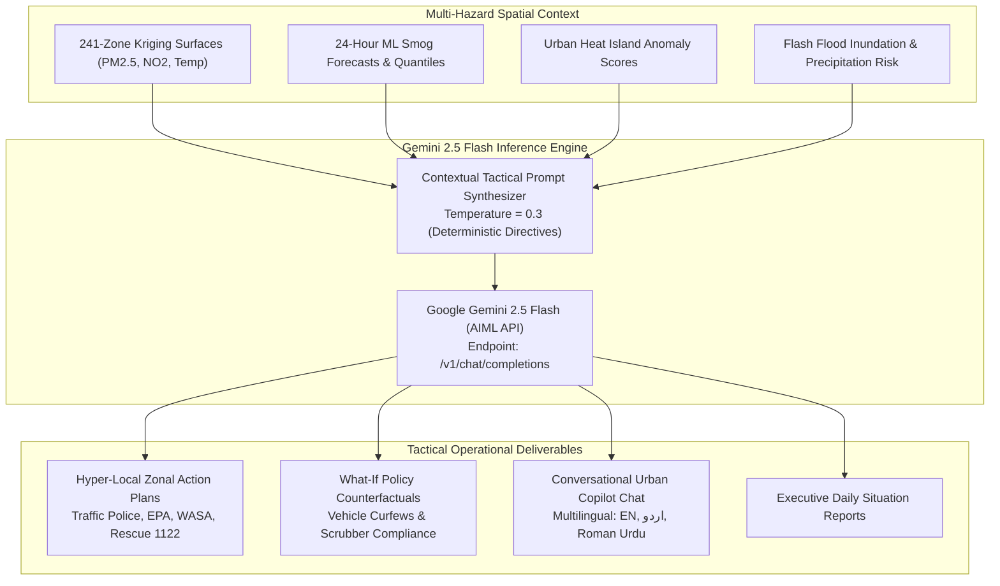

# Generative AI Urban Risk Intelligence Copilot Manual

**Document Version:** 4.0.0  
**Target Metropolitan Area:** Lahore District, Punjab, Pakistan  
**Downstream Consumers:** District Disaster Management Authority, Municipal Commissioners, Field Responders, Web GIS Dashboard  

---

## 1. Executive Summary & AI Copilot Role

Standard municipal disaster response often suffers from information fragmentation: sensor telemetry, meteorological forecasts, and spatial risk maps exist in silos, requiring hours of manual synthesis by disaster analysts. 

The **Generative AI Urban Risk Intelligence Copilot** provides an integrated natural language intelligence layer powered by **Google Gemini 2.5 Flash** (via AIML API). The copilot synthesizes real-time geostatistical Kriging surfaces, 24-hour predictive machine learning forecasts, satellite fire observations, and hydrological waterlogging vulnerability into structured, actionable operational directives.



---

## 2. Core Functional Capabilities

### 2.1 Hyper-Local Zonal Operational Mitigation Plans
Given any zone ID (e.g. `ZONE-LHR-0162`), the AI Copilot compiles real-time telemetry, 24-hour predictive forecasts, DEM elevation, road density, and satellite fire hotspots into a comprehensive tactical operational briefing.

#### Output Structure:
1. **Operational Threat Classification:** Composite emergency tier with 2-sentence executive summary.
2. **Telemetry & Predictive Risk Baseline Table:** Current vs forecasted values, risk drivers.
3. **Multi-Agency Action Directives:**
   - **Traffic Police & Punjab EPA:** Specific heavy vehicle curfews, arterial diversions, anti-smog misting cannon routes.
   - **WASA & Municipal Services:** Preventive drain desilting, mobile suction pump positioning in depression sinks.
   - **Rescue 1122 & Emergency Healthcare:** Pre-positioning mobile respiratory triage units, shaded misting stations.
4. **Public Health Advisory:** Clear protective instructions for asthmatics, children, elderly, and outdoor laborers.
5. **Projected Mitigation Impact Table:** Quantified percentage pollutant/runoff reduction per intervention.

---

### 2.2 Interactive 'What-If' Policy & Disaster Counterfactual Simulation
The AI Copilot allows urban planners and municipal commissioners to evaluate the projected impact of policy interventions before enacting emergency ordinances:

- **Scenario 1: Heavy Commercial Vehicle Curfew:** Simulates the effect of banning heavy diesel trucks from entering ring road corridors between 06:00 and 10:00 (estimated $\text{PM}_{2.5}$ reduction: $-15\%\text{--}25\%$).
- **Scenario 2: Industrial Cluster Temporary Shutdown:** Simulates 48-hour closure of brick kilns and steel re-rolling mills in Northern Lahore (estimated local $\text{PM}_{2.5}$ reduction: $-20\%\text{--}35\%$).
- **Scenario 3: Severe Cloudburst Rainfall Increase ($+40\text{ mm}$):** Simulates drainage system inundation if a $50\text{ mm}$ storm escalates to $90\text{ mm}$, identifying newly compromised underpasses and evacuation zones.

---

### 2.3 Natural Language Urban Risk Copilot Chat
Field officers and system operators can query the platform conversationally via natural language:
- *"Which 5 zones have the highest flash flood vulnerability if 60mm rain falls tonight?"*
- *"Explain why Zone 0086 has a high smog forecast despite moderate wind speeds."*
- *"Draft an urgent Urdu broadcast alert for citizens in Lakshmi Chowk regarding street waterlogging."*

---

## 3. Multilingual Prompt Architecture & Localization

The copilot supports three synchronized linguistic output profiles:

```python
lang_instruction = "Provide the entire briefing in professional English."
if language == "ur":
    lang_instruction = "Provide the briefing in formal Urdu (اردو) with professional disaster-management terminology."
elif language == "roman_ur":
    lang_instruction = "Provide the briefing in clear Roman Urdu (Urdu written in Latin alphabet) for field dispatch officers."
```

### English Mitigation Plan Output Excerpt:
```markdown
### 🚨 Operational Threat Classification
> **[CRITICAL EMERGENCY]** Zone ZONE-LHR-0162 (Gulberg III) is projected to experience a severe particulate surge to **185.4 µg/m³** within the next 24 hours under acute atmospheric stagnation (Stagnation Index: 8.45).

### 📋 Multi-Agency Operational Directives
* **🚓 Traffic Police & Punjab EPA**:
  - Enforce immediate curfew on heavy diesel freight along Main Boulevard from 05:00 to 11:00.
  - Deploy 2 high-capacity anti-smog water misting cannons along Gurumangat and MM Alam Roads.
* **🚰 WASA & Municipal Services**:
  - Clear stormwater gullies along Main Market to prevent localized ponding during secondary misting.
* **🚑 Rescue 1122 & Healthcare**:
  - Pre-position 1 Mobile Oxygen Relief Unit at Liberty Chowk for respiratory distress triage.
```

---

## 4. Fallback Heuristic Rule Engine

To guarantee 100% platform availability even during external API downtime or network partitioning, the copilot includes an automated fallback rule engine:
- If `AIML_API_KEY` is missing or the external API returns an HTTP error, the system automatically engages the deterministic fallback generator (`_generate_fallback_mitigation()`).
- The fallback generator produces a complete, formatted Markdown briefing matching the exact required structure based on physical threshold matrices.

---

## 5. Public Python Facade Interface (`ai/interface.py`)

```python
from ai.interface import (
    generate_zone_mitigation,
    chat_with_copilot,
    simulate_policy_scenario,
    get_ai_health,
)

# 1. Generate hyper-local operational mitigation plan for a zone
mitigation = generate_zone_mitigation("ZONE-LHR-0075", language="en")
print(mitigation["briefing_markdown"])

# 2. Query Copilot via Natural Language
response = chat_with_copilot("What are the top 3 smog hotspots predicted for tomorrow morning?")
print(response["reply"])

# 3. AI Service Health Diagnostics
health = get_ai_health()
print(f"AIML Model: {health['model']}")
print(f"API Configured: {health['api_configured']}")
```

---

## 6. Verification & Automated Unit Tests

The AI Copilot service is validated by unit tests in `tests/test_api.py`:
- `test_ai_mitigation_endpoint` — Verifies valid Markdown briefing generation across zones.
- `test_ai_chat_endpoint` — Tests conversational multi-turn inquiry handling.
- `test_ai_fallback_resilience` — Verifies deterministic fallback activation during simulated network disconnections.
