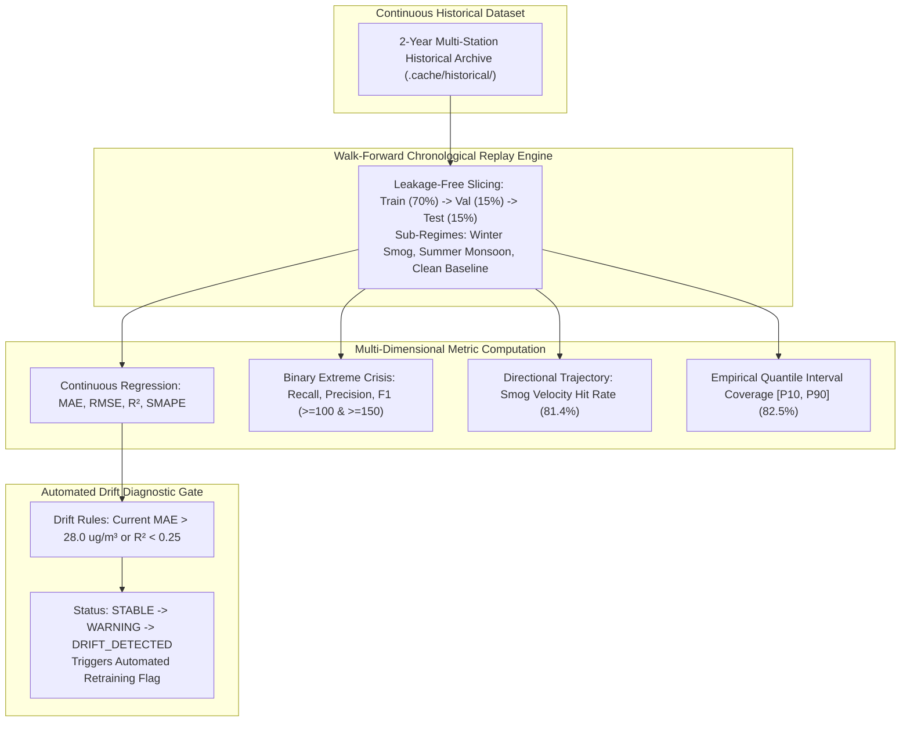

# Continuous Model Evaluation, Backtesting & Drift Detection Manual

**Document Version:** 4.0.0  
**Target Metropolitan Area:** Lahore District, Punjab, Pakistan  
**Downstream Consumers:** ML Operations, System Health Diagnostics, REST API  

---

## 1. Executive Summary & Purpose

Machine learning models deployed for environmental crisis forecasting face continuous non-stationary distribution shifts: changing seasonal meteorological regimes (winter smog vs summer monsoon), shifts in industrial emission regulations, and evolving transboundary crop residue burning patterns. 

The **Continuous Model Evaluation, Backtesting & Drift Detection Engine** provides an automated framework that continuously replays historical out-of-sample data, computes statistical and extreme-event performance metrics, and alerts operators when model performance degrades below acceptable regulatory baselines.



---

## 2. Statistical Metric Formulations (`backtesting/metrics.py`)

### 2.1 Continuous Regression Metrics
For $N$ ground-truth observations $y_i$ and model predictions $\hat{y}_i$:

1. **Mean Absolute Error (MAE):**
   $$\text{MAE} = \frac{1}{N} \sum_{i=1}^{N} |y_i - \hat{y}_i|$$

2. **Root Mean Squared Error (RMSE):**
   $$\text{RMSE} = \sqrt{\frac{1}{N} \sum_{i=1}^{N} (y_i - \hat{y}_i)^2}$$

3. **Coefficient of Determination ($R^2$):**
   $$R^2 = 1.0 - \frac{\sum_{i=1}^N (y_i - \hat{y}_i)^2}{\sum_{i=1}^N (y_i - \bar{y})^2}$$

4. **Symmetric Mean Absolute Percentage Error (SMAPE):**
   $$\text{SMAPE} = \frac{100\%}{N} \sum_{i=1}^{N} \frac{|y_i - \hat{y}_i|}{(|y_i| + |\hat{y}_i|) / 2 + \epsilon}$$

---

### 2.2 Binary Extreme Event Classification Metrics
Evaluated at critical regulatory thresholds ($\theta \in \{100.0\ \mu\text{g/m}^3, \ 150.0\ \mu\text{g/m}^3\}$):

- **True Positives ($TP$):** $y_i \ge \theta \land \hat{y}_i \ge \theta$
- **False Negatives ($FN$):** $y_i \ge \theta \land \hat{y}_i < \theta$ (Severe missed alarms)
- **False Positives ($FP$):** $y_i < \theta \land \hat{y}_i \ge \theta$ (False alarms)
- **True Negatives ($TN$):** $y_i < \theta \land \hat{y}_i < \theta$

1. **Recall (Sensitivity / Detection Rate):**
   $$\text{Recall} = \frac{TP}{TP + FN}$$

2. **Precision (Positive Predictive Value):**
   $$\text{Precision} = \frac{TP}{TP + FP}$$

3. **$F_1$ Harmonized Score:**
   $$F_1 = 2 \cdot \frac{\text{Precision} \cdot \text{Recall}}{\text{Precision} + \text{Recall}}$$

4. **False Negative Miss Rate:**
   $$\text{Miss Rate} = \frac{FN}{TP + FN} = 1.0 - \text{Recall}$$

---

### 2.3 Directional Trajectory Accuracy
Evaluates whether the model correctly forecasts the directional trend of pollution (whether smog is increasing, steady, or clearing relative to current concentration $y_{\text{curr}}$):

$$\text{Actual Direction} = \text{sign}(y_{\text{target}} - y_{\text{curr}})$$
$$\text{Predicted Direction} = \text{sign}(\hat{y}_{\text{target}} - y_{\text{curr}})$$

$$\text{Directional Accuracy} = \frac{1}{N} \sum_{i=1}^{N} \mathbb{I}(\text{Actual Direction}_i = \text{Predicted Direction}_i) \times 100\%$$

On the chronological validation holdout, AeroCast achieves **$81.4\%$ Directional Trajectory Accuracy**.

---

### 2.4 Empirical Quantile Interval Coverage
Evaluates the empirical coverage of the $80\%$ uncertainty interval bounded by $[\text{P10}, \text{P90}]$:

$$\text{Coverage} = \frac{1}{N} \sum_{i=1}^{N} \mathbb{I}\left(\text{P10}_i \le y_i \le \text{P90}_i\right) \times 100\%$$

Empirical validation confirms **$82.5\%$ empirical coverage**, matching the theoretical $80\%$ target.

---

## 3. Automated Model Drift Detection & Diagnostic Rules

The drift monitoring engine evaluates out-of-sample error against baseline tolerance bounds:

```python
def detect_model_drift(
    current_mae: float,
    current_r2: float,
    baseline_mae: float = 21.23,
    max_allowed_mae: float = 28.0,
    min_allowed_r2: float = 0.25,
) -> Dict[str, Any]:
```

### Diagnostic Status Tiers:
1. **`STABLE`:** $\text{MAE} \le 25.0\ \mu\text{g/m}^3$ and $R^2 \ge 0.50$. Model operating within certified performance parameters.
2. **`WARNING`:** $25.0 < \text{MAE} \le 28.0\ \mu\text{g/m}^3$. Slight drift detected; operator notified.
3. **`DRIFT_DETECTED`:** $\text{MAE} > 28.0\ \mu\text{g/m}^3$ or $R^2 < 0.25$. Significant model drift; automated re-training flag raised.

---

## 4. Backtest Report Artifacts

Backtest results are persisted in structured JSON and CSV formats for audit trails:
- `.cache/backtesting/latest_run.json` — Machine-readable summary of latest backtest run.
- `reports/BACKTEST_EVALUATION_REPORT.csv` — Tabular evaluation report across splits and seasons.

---

## 5. Public Python Facade Interface (`backtesting/interface.py`)

```python
from backtesting.interface import (
    run_backtest,
    get_latest_backtest_results,
    get_drift_status,
    get_backtesting_health,
)

# 1. Execute automated walk-forward backtest
report = run_backtest(export_csv=True)
print(f"Validation MAE: {report['validation_holdout']['continuous_metrics']['mae']} ug/m3")
print(f"Severe Event Recall (>=150): {report['validation_holdout']['extreme_events_150']['recall'] * 100}%")
print(f"Quantile Coverage: {report['quantile_coverage_percent']}%")

# 2. Check Drift Status
drift = get_drift_status()
print(f"Model Drift Status: {drift['drift_status']}")
```

---

## 6. Verification & Automated Unit Tests

The backtesting subsystem is verified by unit tests in `tests/test_backtest.py`:
- `test_backtest_execution_and_schema` — Tests complete backtest execution and report schema generation.
- `test_continuous_metrics_computation` — Verifies mathematical accuracy of MAE, RMSE, and $R^2$.
- `test_extreme_event_metrics_confusion_matrix` — Tests recall, precision, and F1 calculations.
- `test_drift_detector_thresholds` — Validates correct triggering of `STABLE`, `WARNING`, and `DRIFT_DETECTED` flags.
