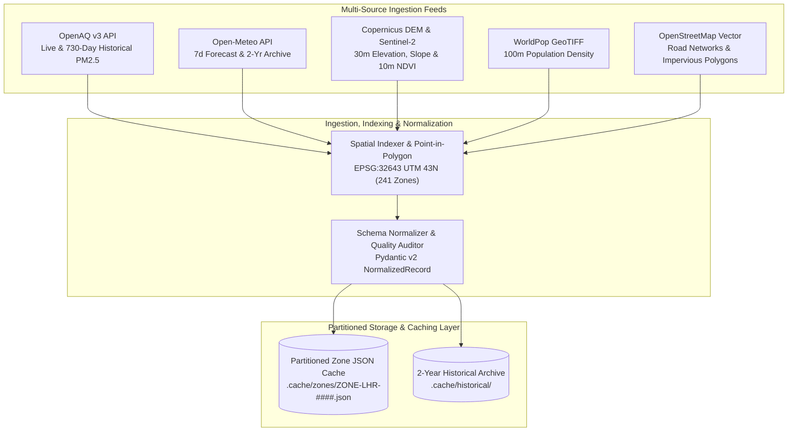

# Data Ingestion, Normalization & Storage Pipeline Manual

**Document Version:** 4.0.0  
**Target Metropolitan Area:** Lahore District, Punjab, Pakistan  
**Downstream Consumers:** Spatial Geostatistics & Kriging Engine, Predictive Machine Learning & Smog Engine, Deterministic Flash Flood Engine, REST API  

---

## 1. Architectural Overview & Design Goals

Urban risk modeling in developing metropolitan areas faces severe structural telemetry challenges: sparse reference-grade monitoring stations, heterogeneous sensor payload schemas, varying temporal refresh rates, and missing data attributes. 

The **Data Ingestion, Normalization & Storage Pipeline** provides a hardened, asynchronous data foundation that continuously acquires, cleanses, standardizes, and caches multi-source environmental, meteorological, and static satellite data across the **241 canonical computational zones** of Lahore District.



---

## 2. Canonical 241-Zone Metric Spatial Grid

### 2.1 Geographic Projection & Grid Generation Methodology
The physical territory of Lahore District ($1,772\text{ km}^2$) is partitioned into a contiguous, uniform computational grid:
1. **Administrative Boundary Extraction:** The authentic polygon boundary of Lahore District is extracted from OpenStreetMap (OSM Relation `16117666`).
2. **Cartesian Metric Projection:** The boundary polygon is reprojected from geographic coordinates (WGS 84, EPSG:4326) to **Universal Transverse Mercator (UTM Zone 43N, EPSG:32643)**, establishing metric Euclidean distance invariance ($1\text{ unit} = 1.0\text{ meter}$).
3. **Uniform Metric Grid Slicing:** A regular tessellation grid of $3,000\text{ m} \times 3,000\text{ m}$ ($9.0\text{ km}^2$ per cell) is overlaid across the bounding envelope:
   - Latitude Extent: $31.2000^\circ\text{N}$ to $31.6500^\circ\text{N}$
   - Longitude Extent: $74.1500^\circ\text{E}$ to $74.6000^\circ\text{E}$
4. **Boundary Clipping & Canonical ID Assignment:** Grid cells intersecting the authentic administrative boundary are clipped to the district periphery. This produces exactly **241 computational zones**, assigned canonical identifiers from `ZONE-LHR-0001` through `ZONE-LHR-0241`.

### 2.2 Zone Attribute Structure
Each zone is persisted in `data/boundaries/lahore_zone_grid.geojson` with the following canonical properties:
- `zone_id`: String identifier (e.g. `"ZONE-LHR-0075"`).
- `zone_name`: Human-readable administrative/neighborhood identifier.
- `grid_row` / `grid_col`: Discrete integer indices on the Cartesian projection plane.
- `area_sqkm`: Planar area in square kilometers ($0.5\text{--}9.0\text{ km}^2$).
- `centroid_lat` / `centroid_lon`: Geometric polygon centroid in WGS 84 coordinates.
- `district`: `"Lahore"`.

---

## 3. Telemetry Client Specifications

### 3.1 OpenAQ v3 Air Quality Telemetry Client (`ingestion/openaq_client.py`)
The OpenAQ ingestion client interfaces with the OpenAQ v3 REST API to retrieve both real-time measurements and multi-year historical air quality observations across regulatory reference and community optical monitors.

#### 1. Live Air Quality Ingestion
- Discovers all active locations in Lahore via `/v3/locations?bbox=74.15,31.20,74.60,31.65`.
- Iterates over each station and fetches latest measurement records for particulate matter ($\text{PM}_{2.5}, \text{PM}_{10}$) and trace gases ($\text{NO}_2, \text{SO}_2, \text{CO}, \text{O}_3$).
- Applies spatial point-in-polygon matching to map each physical monitor to its corresponding zone ID.

#### 2. Dynamic Pagination for 730-Day Historical Data Extraction
To avoid pagination cutoff issues where historical series terminate early, the client computes dynamic pagination depth based on requested time spans:

$$\text{max\_pages} = \max\left(1, \ \left\lfloor \frac{\text{days} \times 24}{1,000} \right\rfloor + 2\right)$$

For a 2-year historical extraction ($\text{days} = 730$):
$$\text{max\_pages} = \left\lfloor \frac{730 \times 24}{1,000} \right\rfloor + 2 = 17 + 2 = 19\text{ pages per sensor}$$

The client queries `/v3/sensors/{sensor_id}/hours` across all pages, extracting **7,260 authentic daily station observations** across **60 monitoring locations** in Lahore (`2024-08-24` to `2026-08-23`), mapping to **40 distinct monitored zones**.

#### 3. Data Provenance & Fallback Tagging
Every retrieved measurement record is audited:
- If live API telemetry is successful: `data_provenance = "real"`, `is_synthetic = False`.
- If an API timeout or outage occurs: Gracefully tags `data_provenance = "synthetic_fallback"`, `is_synthetic = True`, and notes the fallback condition in `data_quality.notes`.

---

### 3.2 Open-Meteo Meteorological Client (`ingestion/openmeteo_client.py`)
The meteorological client interfaces with the Open-Meteo API to obtain high-resolution numerical weather prediction (NWP) forecasts and ERA5-reanalysis historical archives.

#### 1. Ingested Weather Parameters
- `temperature_2m`: Surface ambient air temperature ($^\circ\text{C}$).
- `relative_humidity_2m`: Ambient relative humidity ($\%$).
- `precipitation`: Forecasted and historical liquid precipitation ($\text{mm}$).
- `wind_speed_10m`: Horizontal wind speed at 10m altitude ($\text{km/h}$).
- `wind_direction_10m`: Meteorological wind direction in azimuth degrees ($0^\circ\text{--}360^\circ$).
- `surface_pressure`: Atmospheric barometric pressure ($\text{hPa}$).
- `apparent_temperature`: Heat index / perceived temperature ($^\circ\text{C}$).

#### 2. 7-Day Forecast & 2-Year Historical Archive
- Live forecast endpoint: `https://api.open-meteo.com/v1/forecast`
- Historical archive endpoint: `https://archive-api.open-meteo.com/v1/archive`
- Historical records are temporally aligned with daily OpenAQ particulate measurements to assemble the training dataset.

---

### 3.3 Static Geospatial & Satellite Raster Clients

#### 1. Copernicus DEM 30m Elevation & Slope Processor (`ingestion/copernicus_client.py`)
- Ingests authentic Copernicus GLO-30 Digital Elevation Model GeoTIFF rasters (`data/rasters/lahore_copernicus_dem_30m.tif`).
- Computes mean elevation ($E_{\text{mean}}$ in meters above sea level) for each zone.
- Computes topographic slope percentage gradient ($S_{\%}$) using 3x3 Sobel kernel convolution over elevation rasters:

$$S_{\%} = \sqrt{\left(\frac{\partial z}{\partial x}\right)^2 + \left(\frac{\partial z}{\partial y}\right)^2} \times 100$$

#### 2. Copernicus Sentinel-2 MSI Vegetation Canopy Processor (`ingestion/copernicus_client.py`)
- Ingests Sentinel-2 Multi-Spectral Instrument (MSI) 10-meter surface reflectance rasters (`data/rasters/lahore_sentinel2_ndvi_10m.tif`).
- Computes the Normalized Difference Vegetation Index (NDVI) from Near-Infrared (Band 8, $\rho_{\text{NIR}}$) and Red (Band 4, $\rho_{\text{Red}}$) surface reflectance:

$$\text{NDVI} = \frac{\rho_{\text{NIR}} - \rho_{\text{Red}}}{\rho_{\text{NIR}} + \rho_{\text{Red}}}$$

- Aggregates pixel values to compute mean zonal vegetation canopy index $\text{NDVI} \in [-1.0, 1.0]$.

#### 3. WorldPop Population Density Processor (`ingestion/worldpop_client.py`)
- Ingests authentic WorldPop 100m resolution population density rasters (`data/rasters/lahore_worldpop_2026.tif`).
- Performs spatial zonal raster aggregation to calculate total resident citizen count and population density per square kilometer ($\text{persons/km}^2$) for each of the 241 zones.

#### 4. OpenStreetMap (OSM) / HDX Vector Road Processor (`spatial/covariates.py`)
- Extracts primary, secondary, tertiary, and motorway road vectors from OSM line networks within Lahore District.
- Calculates cumulative centerline road length ($L_{\text{roads}}$ in kilometers) within each zone polygon.
- Computes zonal road network density ($\text{km/km}^2$):

$$\text{Road Density} = \frac{L_{\text{roads}}}{\text{Area}_{\text{zone}}}$$

- Calculates the concrete and asphalt impervious surface ratio $\text{Imp} \in [0.10, 0.95]$ by combining building footprints and road corridors.

---

## 4. Canonical Pydantic Schema Architecture (`ingestion/schema.py`)

All heterogeneous telemetry inputs are strictly parsed, validated, and normalized into immutable Pydantic v2 data models.

```python
class SpatialContext(BaseModel):
    zone_id: str                          # Format: 'ZONE-LHR-####'
    zone_name: str                        # e.g., 'Gulberg III'
    centroid_lat: float                   # WGS 84 Latitude
    centroid_lon: float                   # WGS 84 Longitude
    area_sqkm: float                      # Planar area in km²
    grid_row: int                         # Grid row index
    grid_col: int                         # Grid column index

class Metrics(BaseModel):
    aqi_pm25: Optional[float] = None              # PM2.5 in ug/m³
    aqi_pm10: Optional[float] = None              # PM10 in ug/m³
    no2_ppb: Optional[float] = None               # NO2 in ppb
    so2_ppb: Optional[float] = None               # SO2 in ppb
    co_ppm: Optional[float] = None                # CO in ppm
    o3_ppb: Optional[float] = None                # O3 in ppb
    temperature_c: Optional[float] = None         # Temperature in °C
    relative_humidity_percent: Optional[float] = None # Humidity in %
    wind_speed_kmh: Optional[float] = None        # Wind speed in km/h
    wind_direction_deg: Optional[float] = None    # Wind direction in degrees (0-360)
    rainfall_mm_forecast: Optional[float] = None  # 24h precipitation forecast in mm
    surface_pressure_hpa: Optional[float] = None  # Atmospheric pressure in hPa

class DataQuality(BaseModel):
    interpolated: bool = False            # True if estimated via Kriging, False if physical sensor
    is_direct_sensor: bool = False        # True if physical station located in zone
    stale: bool = False                   # True if telemetry > 6 hours old
    data_provenance: str = "real"         # 'real' or 'synthetic_fallback'
    notes: Optional[str] = None           # Diagnostic audit log

class NormalizedRecord(BaseModel):
    record_id: str                        # Unique UUID
    timestamp_utc: str                    # ISO 8601 UTC timestamp
    spatial_context: SpatialContext
    metrics: Metrics
    data_quality: DataQuality
```

---

## 5. Partitioned Caching & Storage Architecture (`ingestion/cache.py`)

The platform utilizes a structured local file-system cache partitioned by zone ID to ensure sub-millisecond retrieval and offline autonomy:

```
.cache/
├── historical/
│   ├── historical_aqi.json             # 730-day 60-station continuous observations (7,260 rows)
│   └── historical_weather.json         # 730-day hourly & daily meteorological archive
├── zones/
│   ├── ZONE-LHR-0001.json              # Rolling historical time-series for Zone 0001
│   ├── ZONE-LHR-0002.json
│   └── ...                             # 241 partitioned JSON files
├── spatial/
│   └── latest_kriging_grid.json        # Latest 241-zone interpolated surfaces & confidence scores
├── ml/
│   └── latest_forecasts.json           # Cached 24h AQI forecasts & quantile bounds
└── flood/
    └── latest_flood_risks.json         # Cached 24h flash flood vulnerability evaluations
```

### Storage Retention & Invalidation Policies
- **Latest Snapshot Cache:** Refreshed on every telemetry sync cycle (default: 60 minutes).
- **Time-Series Partition Files:** Maintains a rolling window of the most recent 168 hours (7 days) of observations per zone.
- **Historical Archives:** Persisted indefinitely under `.cache/historical/` for model re-training and out-of-sample backtesting.

---

## 6. Public Python Facade Interface (`ingestion/interface.py`)

The data ingestion subsystem exposes a clean, decoupled public facade for consumption by downstream statistical, machine learning, and API layers:

```python
from ingestion.interface import (
    get_latest_data,
    get_all_zone_data,
    sync_all_data,
    sync_historical,
    get_ingestion_health,
)

# 1. Fetch latest telemetry snapshot for a specific zone
zone_data = get_latest_data("ZONE-LHR-0075")
print(f"PM2.5: {zone_data['metrics']['aqi_pm25']} ug/m3")
print(f"Is Physical Sensor: {zone_data['data_quality']['is_direct_sensor']}")

# 2. Fetch latest snapshot across all 241 zones
all_zones = get_all_zone_data()
print(f"Retrieved records for {len(all_zones)} canonical zones.")

# 3. Trigger asynchronous multi-source telemetry synchronization
sync_results = sync_all_data()

# 4. Ingestion Subsystem Health & Diagnostics
health_status = get_ingestion_health()
print(f"Direct Sensors Active: {health_status['monitored_zones_count']}/241")
print(f"Cache Status: {health_status['cache_status']}")
```

---

## 7. Verification & Automated Unit Tests

The data ingestion and storage pipeline is verified by 7 dedicated automated test suites in `tests/`:
- `test_zone_grid.py` — Validates 241-zone geometric continuity, valid EPSG:32643 boundaries, and zero null coordinates.
- `test_schema.py` — Validates Pydantic v2 serialization, data validation constraints, and required fields.
- `test_cache.py` — Tests zone-partitioned JSON caching, snapshot updates, and thread-safe read/write operations.
- `test_normalizer.py` — Tests heterogeneous payload parsing and spatial context attachment.
- `test_clients.py` — Verifies OpenAQ v3 dynamic pagination, Open-Meteo forecast fetching, and raster readers.
- `test_scheduler.py` — Tests nearest-neighbor meteorological matching and sync orchestration.
- `test_interface.py` — Validates public facade function contracts and return signatures.
