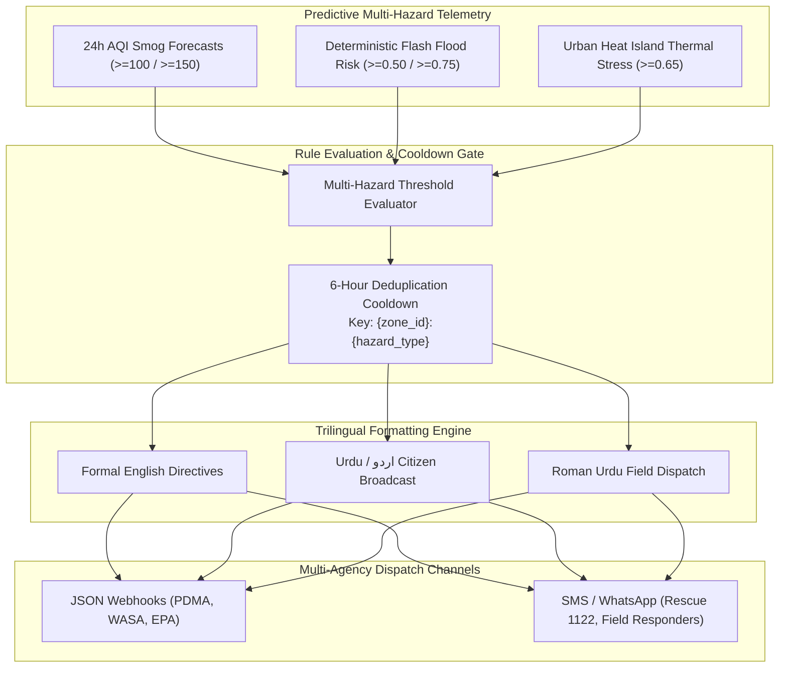

# Multi-Hazard Early Warning & Notification Dispatch Engine Manual

**Document Version:** 4.0.0  
**Target Metropolitan Area:** Lahore District, Punjab, Pakistan  
**Downstream Consumers:** Punjab Disaster Management Authority (PDMA), Water and Sanitation Agency (WASA), Environmental Protection Agency (EPA Punjab), Punjab Emergency Service (Rescue 1122), REST API, Web GIS Dashboard  

---

## 1. Executive Summary & Operational Role

Predictive hazard forecasts are clinically actionable only if translated into rapid, structured, and deduplicated emergency notifications. In past disaster events in Lahore, disaster management agencies struggled with alert fatigue caused by repetitive, unstructured notifications.

The **Multi-Hazard Early Warning & Notification Dispatch Engine** provides an automated rule-evaluation, cooldown management, and multi-channel dispatch pipeline across all **241 canonical zones** of Lahore District:
1. **Multi-Hazard Threshold Evaluation:** Continuously monitors 24-hour predictive smog forecasts, flash flood vulnerability scores, and Urban Heat Island indices.
2. **6-Hour Deduplication & Cooldown Engine:** Enforces strict spatial-hazard cooldown keys (`{zone_id}:{hazard_type}`) to eliminate alert spam.
3. **Trilingual Dynamic Template Rendering:** Generates synchronized early warnings in formal English, authentic Urdu (اردو Unicode), and field-grade Roman Urdu.
4. **Multi-Channel Dispatch Protocol:** Formats structured JSON webhooks for municipal command centers (PDMA, WASA, EPA) and SMS/WhatsApp payloads for field rescue operators (Rescue 1122).



---

## 2. Multi-Hazard Evaluation Rules & Thresholds

The engine evaluates hazard thresholds across all 241 zones on every operational cycle:

| Hazard Type | Trigger Metric | Severity Level | Activation Threshold | Public Advisory & Inter-Agency Directive |
|---|---|:---:|:---:|---|
| **Severe Smog Spike** | Forecasted $\text{PM}_{2.5}$ ($t+24\text{h}$) | 🔴 **Emergency** | $\hat{y} \ge 150.0\ \mu\text{g/m}^3$ | Wear N95 masks; deploy EPA anti-smog water cannons; restrict heavy diesel vehicle entry. |
| **High Pollution Alert** | Forecasted $\text{PM}_{2.5}$ ($t+24\text{h}$) | 🟡 **Warning** | $\hat{y} \ge 100.0\ \mu\text{g/m}^3$ | Avoid morning outdoor exercise; enforce dust suppression at construction sites. |
| **Flash Flood Emergency** | Flash Flood Risk Score | 🔴 **Emergency** | $R_{\text{flood}} \ge 0.75$ | Critical waterlogging ($> 25\text{ cm}$); close low-lying underpasses; WASA heavy mobile pumps. |
| **Waterlogging Watch** | Flash Flood Risk Score | 🟡 **Watch** | $R_{\text{flood}} \ge 0.50$ | Street ponding ($8\text{--}25\text{ cm}$); clear stormwater inlets; WASA suction squads standby. |
| **Urban Heat Stress** | UHI Thermal Risk Score | 🟡 **Watch** | $R_{\text{UHI}} \ge 0.65$ | Extreme thermal inertia; Rescue 1122 hydration stations; shaded rest mandates for laborers. |

---

## 3. Deduplication & 6-Hour Cooldown Mechanism

To prevent overwhelming emergency channels during continuous multi-day smog or monsoon crises, the dispatcher implements a stateful cooldown registry:

```python
cooldown_key = f"{zone_id}:{hazard_type}"  # e.g., "ZONE-LHR-0075:smog"
```

1. **Active Check:** When a zone breaches a hazard threshold, the dispatcher queries `_cooldowns[cooldown_key]`.
2. **Window Enforcement:** If the timestamp difference $\Delta t = t_{\text{current}} - t_{\text{last\_alert}} < 6\text{ hours}$, the alert is suppressed as a duplicate.
3. **Escalation Override:** If the severity escalates (e.g. from `WARNING` to `EMERGENCY`), the cooldown is immediately bypassed, and an upgraded alert is dispatched.
4. **Automatic Expiry:** Alerts carry a 24-hour expiration window (`expires_at_utc`), after which they are archived to `alert_history.json`.

---

## 4. Trilingual Message Formatting (`alerts/templates.py`)

Every generated alert compiles structured, human-readable notifications across three language profiles:

### 4.1 English Output Example (Formal Institutional Directives)
```
[CRITICAL EMERGENCY] 24h Severe Smog Spike in Zone ZONE-LHR-0162 (Gulberg III)
Predicted PM2.5: 185.4 µg/m³ (Current: 72.1 µg/m³ | 80% CI: 165.0 - 210.0 µg/m³)
Citizen Action: Wear N95 masks, avoid outdoor exercise, keep windows closed.
Authority Action: Deploy EPA anti-smog squads, restrict industrial emissions, enforce dust control.
```

### 4.2 Urdu Output Example (اردو Citizen Broadcast)
```
[ہنگامی الرٹ] زون ZONE-LHR-0162 (Gulberg III) میں اگلے 24 گھنٹوں کے دوران شدید اسموگ کا خطرہ
متوقع PM2.5: 185.4 مائیکرو گرام/کیوبک میٹر (موجودہ: 72.1 مائیکرو گرام/کیوبک میٹر)
شہریوں کے لیے ہدایات: این 95 ماسک لازمی استعمال کریں، کھڑکیوں کو بند رکھیں، اور صبح کی ورزش سے گریز کریں۔
حکام کے لیے ہدایات: محکمہ تحفظ ماحول فوری اینٹی اسموگ سکواڈز تعینات کرے اور گردوغبار پر کنٹرول کرے۔
```

### 4.3 Roman Urdu Output Example (Field Officer Dispatch)
```
[EMERGENCY ALERT] Zone ZONE-LHR-0162 (Gulberg III) mein aglay 24 ghantay mein Shadeed Smog ka imkaan.
Predicted PM2.5: 185.4 µg/m³ (Current: 72.1 µg/m³).
Awam ke liye hidayat: N95 mask pehnen, subah bahir nikalne se parhez karen.
Team Action: EPA anti-smog misting cannons foran rawana karen.
```

---

## 5. Schema Specifications (`alerts/models.py`)

```python
class SeverityLevel(str, Enum):
    INFO = "INFO"
    WATCH = "WATCH"
    WARNING = "WARNING"
    EMERGENCY = "EMERGENCY"

class HazardType(str, Enum):
    SMOG = "smog"
    FLASH_FLOOD = "flash_flood"
    HEAT_ISLAND = "heat_island"

class AlertChannel(str, Enum):
    WEBHOOK = "webhook"
    SMS = "sms"
    WHATSAPP = "whatsapp"
    EMAIL = "email"

class HazardAlert(BaseModel):
    alert_id: str                          # Format: 'ALT-SMG-ZONE-LHR-0075'
    zone_id: str
    zone_name: str
    hazard_type: HazardType
    severity: SeverityLevel
    title: str
    trigger_metric: str
    trigger_value: float
    threshold_value: float
    unit: str
    messages: Dict[str, str]               # {'en': ..., 'ur': ..., 'roman_ur': ...}
    actionable_instructions: Dict[str, str]# {'citizens': ..., 'authorities': ...}
    timestamp_utc: str
    expires_at_utc: str
    cooldown_key: str
```

---

## 6. Simulated Dispatch Protocol & Agency Subscriptions

The platform manages stakeholder subscriptions in `.cache/alerts/subscriptions.json`:

```json
[
  {
    "subscription_id": "SUB-PDMA-01",
    "agency_name": "Punjab Disaster Management Authority (PDMA)",
    "channel": "webhook",
    "target": "https://api.pdma.punjab.gov.pk/v1/early-warning/webhooks",
    "subscribed_zones": ["ALL"],
    "subscribed_hazards": ["smog", "flash_flood", "heat_island"],
    "min_severity": "WATCH"
  },
  {
    "subscription_id": "SUB-WASA-01",
    "agency_name": "Water and Sanitation Agency (WASA Lahore)",
    "channel": "webhook",
    "target": "https://wasa.punjab.gov.pk/api/drainage/alerts",
    "subscribed_zones": ["ALL"],
    "subscribed_hazards": ["flash_flood"],
    "min_severity": "WATCH"
  },
  {
    "subscription_id": "SUB-RESCUE-01",
    "agency_name": "Punjab Emergency Service (Rescue 1122)",
    "channel": "sms",
    "target": "+923001122000",
    "subscribed_zones": ["ALL"],
    "subscribed_hazards": ["smog", "flash_flood"],
    "min_severity": "WARNING"
  }
]
```

---

## 7. Public Python Facade Interface (`alerts/interface.py`)

```python
from alerts.interface import (
    evaluate_and_dispatch_alerts,
    get_active_alerts,
    get_alert_history,
    subscribe_to_alerts,
    get_alerts_health,
)

# 1. Execute automated multi-hazard evaluation and dispatch
dispatch_summary = evaluate_and_dispatch_alerts()
print(f"Generated Alerts: {dispatch_summary['alerts_generated']}")
print(f"Dispatched Notifications: {dispatch_summary['dispatched_count']}")

# 2. Query active alerts across Lahore
active = get_active_alerts()
for alert in active:
    print(f"[{alert['severity']}] {alert['hazard_type']} in {alert['zone_id']}: {alert['title']}")

# 3. Subsystem Health Diagnostics
health = get_alerts_health()
print(f"Active Cooldowns: {health['active_cooldowns_count']}")
```

---

## 8. Verification & Automated Unit Tests

The early warning dispatcher is validated by unit tests in `tests/test_alerts.py`:
- `test_alert_evaluation_triggers_on_high_values` — Verifies thresholds trigger correct severity levels.
- `test_cooldown_deduplication` — Tests 6-hour cooldown suppression of duplicate alerts.
- `test_trilingual_template_rendering` — Verifies valid English, Urdu Unicode, and Roman Urdu formatting.
- `test_subscription_dispatch_filtering` — Validates agency channel filtering based on subscribed hazard types and minimum severity.
