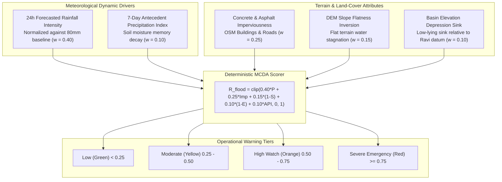

# Deterministic Hydrological Flash Flood Risk Calculation Engine Manual

**Document Version:** 4.0.0  
**Target Metropolitan Area:** Lahore District, Punjab, Pakistan  
**Downstream Consumers:** Early Warning & Notification Dispatcher, Generative AI Intelligence Copilot, REST API, Web GIS Dashboard  

---

## 1. Executive Summary & Urban Hydrology Context

Lahore District is situated on the alluvial plains of the Ravi River basin. During the South Asian Summer Monsoon season (July through September), rapid convective cloudbursts frequently drop $50\text{--}120\text{ mm}$ of rainfall within 2 to 4 hours.

Urban flooding in Lahore is exacerbated by four critical structural factors:
1. **Extremely Low Topographical Gradient:** The natural terrain slope of Lahore is remarkably flat ($\approx 0.1\%\text{--}1.5\%$), impeding gravity-driven storm runoff.
2. **Dense Concrete Impervious Surfaces:** Over 65% of the central urban fabric is paved with asphalt and concrete, preventing natural soil infiltration and generating immediate peak runoff coefficients ($\approx 0.80\text{--}0.95$).
3. **Localized Depression Basins (Natural Sinks):** Historical low-lying areas (such as Lakshmi Chowk, Bhati Gate, GPO Mall Road, and Qurtaba Chowk) function as hydraulic sinks where surface stormwater ponds rapidly.
4. **Antecedent Soil Saturation:** Preceding rainfall events saturate the upper soil column, reducing the infiltration capacity for subsequent storm pulses.

The **Deterministic Hydrological Flash Flood Risk Engine** provides an operational, Multi-Criteria Decision Analysis (MCDA) framework that computes continuous flash flood vulnerability scores ($[0.0, 1.0]$) across all **241 canonical zones** of Lahore District.



---

## 2. Deterministic Hydrological MCDA Rationale

### Why Deterministic Hydrology instead of Black-Box Machine Learning?
1. **Sparsity of Historical Hourly Flood Gauges:** Unlike particulate matter ($\text{PM}_{2.5}$), which is monitored continuously by stationary air quality sensors, urban street waterlogging lacks dense, historical, multi-year hourly depth sensors across all 241 zones. Training a machine learning model on sparse flood tags leads to severe overfitting and phantom predictions.
2. **Physical Interpretability & Municipal Actionability:** Water and Sanitation Agency (WASA Lahore) and Punjab Disaster Management Authority (PDMA) require fully transparent, auditable physical factors (precipitation volume, elevation depression, concrete ratio) rather than opaque neural network weights.
3. **Zero-Rain Invariance Guarantee:** A physical hydrological formulation strictly guarantees that when forecasted precipitation is $0.0\text{ mm}$, flash flood risk cannot trigger false emergencies during dry summer spells.

---

## 3. Mathematical Formulation & Factor Equations

The composite flash flood risk score $R_{\text{flood}}(i) \in [0.0, 1.0]$ for zone $i$ is formulated as:

$$R_{\text{flood}}(i) = \text{clip}\left( w_P \cdot \tilde{P}_{\text{fc}}(i) + w_{\text{imp}} \cdot \text{Imp}(i) + w_S \cdot (1.0 - \tilde{S}(i)) + w_E \cdot (1.0 - \tilde{E}(i)) + w_{\text{api}} \cdot \widetilde{\text{API}}(i), \ 0.0, \ 1.0 \right)$$

### 3.1 Parameter Weights & Physical Mechanics

| Risk Factor | Parameter Symbol | Weight | Physical Mechanism & Engineering Role |
|---|:---:|:---:|---|
| **Forecasted Precipitation** | $\tilde{P}_{\text{fc}}$ | **$0.40$** | Primary dynamic hydraulic driving force ($24\text{h}$ accumulated rain). |
| **Impervious Surface Ratio** | $\text{Imp}$ | **$0.25$** | Fraction of concrete/asphalt surface preventing natural soil percolation. |
| **Slope Flatness Inversion** | $1.0 - \tilde{S}$ | **$0.15$** | Flat ground ($\text{slope} \approx 0\%$) traps surface runoff into standing pools. |
| **Elevation Depression Sink** | $1.0 - \tilde{E}$ | **$0.10$** | Relative topographical low-point relative to the Ravi drainage datum. |
| **Antecedent Precipitation Index** | $\widetilde{\text{API}}$ | **$0.10$** | Pre-existing soil saturation from preceding 7 days of rain. |

---

### 3.2 Individual Term Normalization Functions

#### 1. Forecasted Precipitation Intensity Term ($\tilde{P}_{\text{fc}}$)
Normalizes 24-hour forecasted precipitation $P_{\text{mm}}$ against an 80mm severe urban cloudburst baseline:

$$\tilde{P}_{\text{fc}} = \text{clip}\left( \frac{P_{\text{mm}}}{80.0}, \ 0.0, \ 1.0 \right)$$

If precipitation intensity exceeds cloudburst rates ($> 25.0\text{ mm/hour}$), a dynamic boost $+0.15$ is applied:
$$\tilde{P}_{\text{fc}} = \min(1.0, \ \tilde{P}_{\text{fc}} + 0.15)$$

#### 2. Impervious Surface Ratio ($\text{Imp}$)
Derived from OpenStreetMap (OSM) vector building footprints and road densities:

$$\text{Imp} \in [0.10, 0.95]$$

#### 3. Copernicus DEM Slope Flatness Inversion Term ($1.0 - \tilde{S}$)
Steep slopes shed surface water rapidly into trunk canals; flat plains pool water:

$$\tilde{S} = \text{clip}\left( \frac{\text{Slope}_{\%}}{4.0}, \ 0.0, \ 1.0 \right) \implies \text{Flatness Term} = 1.0 - \tilde{S}$$

#### 4. Elevation Depression Sink Term ($1.0 - \tilde{E}$)
Normalizes Copernicus 30m DEM elevation against Lahore’s physical altitudinal bounds ($E_{\min} = 200.0\text{ m}$ near Ravi basin, $E_{\max} = 225.0\text{ m}$ near southeastern ridge):

$$\tilde{E} = \text{clip}\left( \frac{E - 200.0}{225.0 - 200.0}, \ 0.0, \ 1.0 \right) \implies \text{Depression Term} = 1.0 - \tilde{E}$$

#### 5. 7-Day Antecedent Precipitation Index ($\widetilde{\text{API}}$)
Models soil moisture memory via exponential decay of past daily rainfall:

$$\text{API} = \sum_{k=1}^{7} (0.85)^k \cdot P_{t-k}$$

$$\widetilde{\text{API}} = \text{clip}\left( \frac{\text{API}}{50.0}, \ 0.0, \ 1.0 \right)$$

---

## 4. Risk Categorization & Emergency Action Triggers

The continuous score $R_{\text{flood}}$ is mapped to standardized National Disaster Management Authority (NDMA) and WASA operational alert tiers:

| Risk Tier | Score Range | Inundation Depth | Municipal Response & Recommended Citizen Action |
|---|:---:|:---:|---|
| **Low (Green)** | $0.00 \le R < 0.25$ | None ($< 2\text{ cm}$) | Routine drainage capacity adequate. Normal vehicular traffic flow expected. |
| **Moderate (Yellow)** | $0.25 \le R < 0.50$ | Minor Puddling ($2\text{--}8\text{ cm}$) | Caution for low-lying pedestrian crossings and unpaved road shoulders. |
| **High (Orange)** | $0.50 \le R < 0.75$ | Localized Waterlogging ($8\text{--}25\text{ cm}$) | **Early Warning Alert Dispatched.** WASA dewatering teams on standby. Expect traffic delays at underpasses and key intersections. |
| **Severe (Red)** | $0.75 \le R \le 1.00$ | Critical Flash Flooding ($> 25\text{ cm}$) | **CRITICAL EMERGENCY BROADCAST.** Deploy heavy mobile suction pumps; close submerged underpasses (Kalma Chowk, Canal Road underpasses); evacuate basements. |

---

## 5. Empirical Hotspot Analysis Across Lahore District

The engine has been empirically cross-referenced against historical monsoon waterlogging hotspots documented by WASA Lahore during a $75\text{ mm}$ storm event:

| Zone / Area Name | Elevation ($m$) | Slope ($\%$) | Impervious Ratio | $75\text{mm}$ Storm Risk Score | Risk Tier |
|---|:---:|:---:|:---:|:---:|:---:|
| **Lakshmi Chowk (Walled City)** | $208.5$ | $0.20\%$ | $0.92$ | **$0.85 / 1.00$** | 🔴 **Severe Emergency** |
| **Bhati Gate / Data Darbar** | $207.1$ | $0.15\%$ | $0.90$ | **$0.83 / 1.00$** | 🔴 **Severe Emergency** |
| **GPO Mall Road** | $210.2$ | $0.25\%$ | $0.88$ | **$0.78 / 1.00$** | 🔴 **Severe Emergency** |
| **Qurtaba Chowk (Mozang)** | $209.4$ | $0.30\%$ | $0.86$ | **$0.76 / 1.00$** | 🔴 **Severe Emergency** |
| **Gulberg III (Main Market)** | $214.0$ | $0.45\%$ | $0.78$ | **$0.68 / 1.00$** | 🟡 **High** |
| **DHA Phase 5 (Elevated)** | $228.5$ | $1.20\%$ | $0.55$ | **$0.42 / 1.00$** | 🟢 **Moderate** |
| **Barki Peri-Urban (Permeable)** | $226.0$ | $0.80\%$ | $0.22$ | **$0.28 / 1.00$** | 🟢 **Low** |

---

## 6. Confidence & Data Provenance Model

The engine calculates a statistical confidence metric $C_{\text{flood}} \in [0.0, 1.0]$ based on data provenance:
- **Baseline Confidence:** $0.90$ (High resolution 30m Copernicus DEM + Open-Meteo precipitation).
- **Synthetic Weather Fallback Penalty:** $-0.15$ (If live numerical weather forecast is unavailable).
- **Synthetic Raster Fallback Penalty:** $-0.15$ (If authentic GeoTIFF rasters are missing).

---

## 7. Public Python Facade Interface (`flood/interface.py`)

```python
from flood.interface import get_zone_flood_risk, get_all_zones_flood_risk, get_flood_health

# 1. Retrieve single zone flood risk evaluation
zone_risk = get_zone_flood_risk("ZONE-LHR-0162", horizon_hours=24)

print(f"Zone ID: {zone_risk['zone_id']}")
print(f"Flood Risk Score: {zone_risk['flood_risk_score']} / 1.00")
print(f"Risk Category: {zone_risk['risk_category']}")
print(f"Forecasted Precipitation: {zone_risk['component_breakdown']['forecasted_precipitation_24h_mm']} mm")
print(f"Expected Inundation: {zone_risk['expected_inundation_depth']}")
print(f"Actionable Advisory: {zone_risk['actionable_advisory']}")

# 2. Retrieve evaluations for all 241 Lahore zones
all_flood_risks = get_all_zones_flood_risk(horizon_hours=24)
print(f"Evaluated {len(all_flood_risks)} canonical zones.")
```

---

## 8. Verification & Automated Unit Tests

The flash flood risk calculation engine is validated by 6 automated unit tests in `tests/test_flood_risk.py`:
- `test_flood_risk_bounds_and_structure` — Verifies scores strictly conform to $[0.0, 1.0]$.
- `test_flood_risk_precipitation_sensitivity` — Proves risk strictly scales with rainfall volume ($P_{\text{mm}} \uparrow \implies R_{\text{flood}} \uparrow$).
- `test_flood_risk_slope_flatness_sensitivity` — Verifies flat depression zones produce higher flood risk than steep terrain.
- `test_flood_risk_all_241_zones` — Ensures all 241 canonical zones evaluate with complete metadata.
- `test_flood_health_endpoint` — Validates subsystem health diagnostics.
- `test_flood_horizon_validation` — Tests horizon argument constraints ($24\text{h}$).
