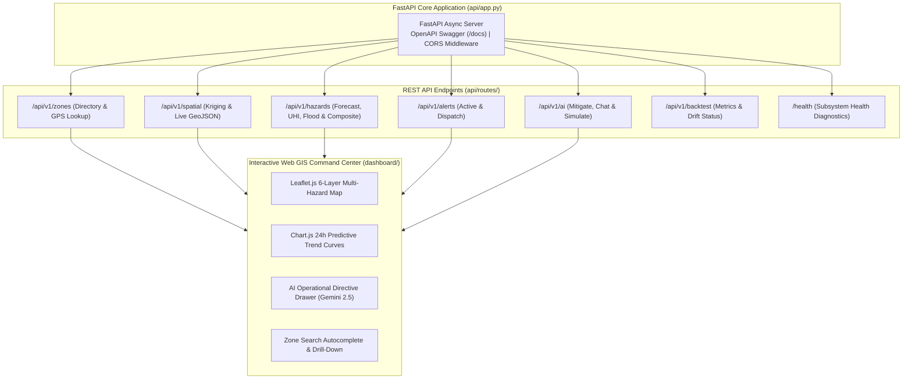

# REST API Layer & Interactive Web GIS Situational Command Center Manual

**Document Version:** 4.0.0  
**Target Metropolitan Area:** Lahore District, Punjab, Pakistan  
**Downstream Consumers:** District Emergency Operations Center, Public Web Portals, External Agency Gateways  

---

## 1. Executive Summary & Delivery Layer Architecture

The **REST API Layer & Interactive Web GIS Situational Command Center** forms the primary integration and visualization tier of AeroCast. It translates geostatistical surfaces, machine learning forecasts, hydrological risk scores, and generative AI mitigations into accessible REST endpoints and a high-performance Web GIS dashboard.



---

## 2. REST API Specifications (FastAPI)

The API is built using **FastAPI** with native Pydantic validation, asynchronous request handling, and automatic OpenAPI schema generation accessible at `/docs`.

### 2.1 Complete Endpoint Directory

| HTTP Method | Route Endpoint | Description & Query Parameters | Sample Response Summary |
|---|---|---|---|
| `GET` | `/health` | Aggregated system health and subsystem diagnostic statuses. | `{"status": "healthy", "subsystems": {...}}` |
| `GET` | `/api/v1/zones` | Returns directory of all 241 canonical zones with centroids and names. | `{"total_zones": 241, "zones": [...]}` |
| `GET` | `/api/v1/zones/{zone_id}` | Detailed multi-hazard snapshot and static covariates for a specific zone. | `{"zone_id": "ZONE-LHR-0075", "forecast": {...}}` |
| `GET` | `/api/v1/zones/lookup` | Spatial point-in-polygon lookup for GPS coordinates (`?lat=31.52&lon=74.35`). | `{"zone_id": "ZONE-LHR-0075", "zone_name": "Gulberg"}` |
| `GET` | `/api/v1/spatial/grid` | Full 241-zone Kriging matrix with estimation variances (`?variable=aqi_pm25`). | `{"variable": "aqi_pm25", "grid": {...}}` |
| `GET` | `/api/v1/spatial/geojson` | Complete GeoJSON FeatureCollection enriched with live Kriging & hazard attributes. | `{"type": "FeatureCollection", "features": [...]}` |
| `GET` | `/api/v1/hazards/forecast` | 24-hour predictive PM2.5 forecasts, quantiles (P10/P50/P90), and hazard categories. | `{"horizon_hours": 24, "forecasts": {...}}` |
| `GET` | `/api/v1/hazards/heat-island` | Zonal Urban Heat Island risk scores and vegetative cooling factors. | `{"uhi_scores": {...}}` |
| `GET` | `/api/v1/hazards/flood` | Deterministic flash flood vulnerability scores and inundation tiers. | `{"flood_risks": {...}}` |
| `GET` | `/api/v1/hazards/unified-risk-summary` | Blended multi-hazard composite priority ranking across all 241 zones. | `{"composite_rankings": [...]}` |
| `GET` | `/api/v1/alerts/active` | Current active, non-expired multi-hazard emergency alerts. | `{"active_alerts": [...]}` |
| `POST` | `/api/v1/alerts/dispatch` | Triggers immediate multi-hazard evaluation and external notification dispatch. | `{"dispatched_count": 5, "alerts": [...]}` |
| `POST` | `/api/v1/alerts/subscribe` | Registers agency webhook or SMS endpoints for automated early warnings. | `{"status": "subscribed", "subscription_id": "..."}` |
| `POST` | `/api/v1/ai/mitigate` | Generates tactical operational mitigation plan for a zone (`{"zone_id": "..."}`). | `{"briefing_markdown": "### Threat Classification..."}` |
| `POST` | `/api/v1/ai/chat` | Conversational natural language urban copilot inquiry (`{"message": "..."}`). | `{"reply": "Based on current Kriging surfaces..."}` |
| `POST` | `/api/v1/ai/simulate` | Interactive 'What-If' policy counterfactual simulation (`{"scenario": "curfew"}`). | `{"projected_reduction": "18%", "analysis": "..."}` |
| `GET` | `/api/v1/backtest/latest` | Latest out-of-sample walk-forward backtesting evaluation report. | `{"validation_holdout": {"mae": 20.93, "r2": 0.757}}` |
| `GET` | `/api/v1/backtest/drift-status` | Model drift diagnostic status (`STABLE` / `WARNING` / `DRIFT_DETECTED`). | `{"drift_status": "STABLE", "current_mae": 20.93}` |

---

## 3. Enriched GeoJSON FeatureCollection Specification

The `/api/v1/spatial/geojson` endpoint produces a standard RFC 7946 GeoJSON FeatureCollection consumed directly by GIS clients:

```json
{
  "type": "FeatureCollection",
  "crs": {
    "type": "name",
    "properties": { "name": "urn:ogc:def:crs:OGC:1.3:CRS84" }
  },
  "features": [
    {
      "type": "Feature",
      "id": "ZONE-LHR-0075",
      "geometry": {
        "type": "Polygon",
        "coordinates": [[[74.345, 31.512], [74.375, 31.512], [74.375, 31.538], [74.345, 31.538], [74.345, 31.512]]]
      },
      "properties": {
        "zone_id": "ZONE-LHR-0075",
        "zone_name": "Gulberg III / Main Market",
        "area_sqkm": 8.95,
        "pm25_current": 72.1,
        "pm25_forecast_24h": 142.5,
        "pm25_uncertainty_interval": [128.0, 168.0],
        "hazard_category": "Unhealthy",
        "extreme_spike_probability": 0.68,
        "kriging_variance": 14.5,
        "spatial_confidence": 0.88,
        "is_direct_sensor": true,
        "uhi_risk_score": 0.61,
        "flood_risk_score": 0.38,
        "composite_risk_score": 0.68,
        "population_density": 14000,
        "elevation_m": 214.0,
        "slope_percent": 0.45,
        "ndvi_index": 0.22
      }
    }
  ]
}
```

---

## 4. Interactive Web GIS Command Center Dashboard

The interactive Web GIS dashboard is served directly at the root URL `/` and `/dashboard`. It is engineered as a zero-dependency, ultra-fast situational command center.

### 4.1 Visual Design System & Aesthetics
- **Theme:** Solid High-Contrast Dark Theme (`#0b0f17` background, `#121824` card containers, `#1e293b` borders).
- **Typography:** Plus Jakarta Sans (UI elements and headings) and JetBrains Mono (numerical telemetry and coordinates).
- **Touch & Click Targets:** Minimum 40px hit targets with smooth micro-animations.

### 4.2 Interactive GIS Capabilities (`dashboard/js/app.js`, `dashboard/js/map.js`)
1. **Multi-Hazard Layer Switcher:**
   - `Layer 1`: 24-Hour Advance $\text{PM}_{2.5}$ Forecast Surface
   - `Layer 2`: Spatial Universal Kriging Current Field
   - `Layer 3`: Urban Heat Island (UHI) Thermal Stress
   - `Layer 4`: Deterministic Flash Flood & Waterlogging Inundation
   - `Layer 5`: Unified Multi-Hazard Composite Vulnerability Index
2. **Zone Search & Autocomplete:** Real-time search bar filtering across all 241 zone IDs and neighborhood names.
3. **Interactive Polygon Drill-Down:** Clicking any zone opens a slide-out drawer containing:
   - Detailed telemetry metrics and physical sensor indicators
   - 24-hour predictive forecast curve with 80% uncertainty interval via Chart.js
   - Component breakdowns for flood and UHI risk
   - Instant "Generate AI Mitigation Plan" button that queries Google Gemini 2.5 Flash live.
4. **Live Incident & Alert Tickers:** Top banner broadcasting active warnings and critical emergency dispatches across Lahore.

---

## 5. Deployment & CLI Execution Commands

The complete REST API and Dashboard are launched via `main.py`:

```bash
# Launch FastAPI backend with interactive dashboard on port 8000
python main.py --serve --port 8000 --host 0.0.0.0

# Execute manual multi-source data sync
python main.py --sync

# Query 24h AQI forecast for a specific zone
python main.py --forecast 24

# Evaluate and dispatch multi-hazard alerts
python main.py --dispatch-alerts

# Run out-of-sample chronological backtest
python main.py --backtest
```
